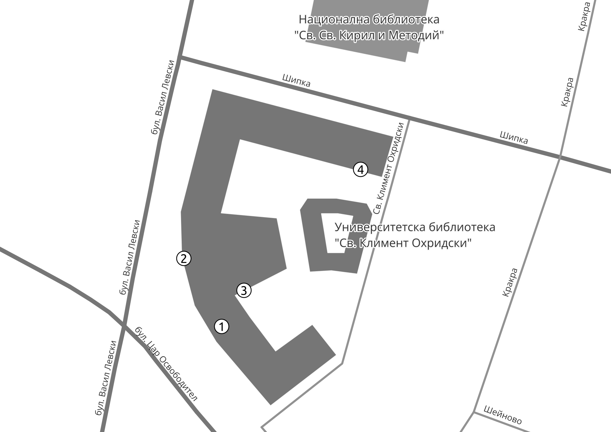

# FOSS4G:BG - отворен ГИС събор 2024
|       |                                                                                                  |
|-------|--------------------------------------------------------------------------------------------------|
| дата  | 12 март 2024                                                                                     |
| място | Зала 1 на Ректората на Софийски университет "Св. Климент Охридски"                               |
| вход  | свободен                                                                                         |

???+ warning "Внимание!"
    Съдържанието на тази страница подлежи на постоянна промяна. За последните новини или мнения относно събитието, моля влезте в [Телеграм канала тук](https://t.me/joinchat/Zxo__KwkcG5mMDU8).

Миниконференция за отворени и свободни географски информационни системи.

Събитието е умалено по мащаб, но не и по замисъл събитие на FOSS4G, ежегодната конференция за отворен геопространствен софтуер, организирана от [OSGeo](https//:osgeo.org).

Състои се от представяния, изрично свързани с отворени и свободни географски технологии.
Всяко представяне се вмества в твърди 15 минути и е последвано от 5 минути дискусия по темата.

Целева група - професионалисти, студенти и ентусиасти.

Цел на събитието - популяризация на отворен ГИС и социализация на ГИС потребителите в България.

## Комуникация

Цялата комуникация и организация на събитието се случва в [Телеграм канала](https://t.me/joinchat/Zxo__KwkcG5mMDU8) на QGIS.bg.

## Програма

???+ info "Забележка"
    Моля, натиснете върху всяко индивидуално събитие за повече информация - начален и краен час, място, лектор, тема и абстракт.

???+ warning "Внимание!"
    Подредбата и описанията на събитията подлежи на постоянни промени до започване на събитието.

<iframe src="https://calendar.google.com/calendar/embed?height=600&wkst=2&ctz=Europe%2FSofia&bgcolor=%23ffffff&hl=bg&showDate=0&showPrint=0&showNav=0&showCalendars=0&showTabs=0&mode=AGENDA&title=FOSS4G%3ABG%20-%20%D0%BE%D1%82%D0%B2%D0%BE%D1%80%D0%B5%D0%BD%20%D0%93%D0%98%D0%A1%20%D1%81%D1%8A%D0%B1%D0%BE%D1%80&src=NGVhNGIxMTg1OGU5YTI4ZTdjZmY2NDI2YTQ3ODRhY2YyNDFhOTZhN2NjZTFhZDUxMDRiMDZhMzc5YzE1M2QzM0Bncm91cC5jYWxlbmRhci5nb29nbGUuY29t&color=%23EF6C00" width="100%" height="600" frameborder="0" scrolling="no"></iframe>

### Вмъкване в собствен календар

Натиснете върху връзката, за да добавите календара към собствения си електронен календар:

https://calendar.google.com/calendar/u/0?cid=NGVhNGIxMTg1OGU5YTI4ZTdjZmY2NDI2YTQ3ODRhY2YyNDFhOTZhN2NjZTFhZDUxMDRiMDZhMzc5YzE1M2QzM0Bncm91cC5jYWxlbmRhci5nb29nbGUuY29t

## Място

Миниконференцията ще се проведе в Зала 1 на Ректората на Софийски университет "Св. Климент Охридски". Залата е разположена на първия етаж в Южното крило на сградата на Ректората. Може да се достъпи лесно както от Централния вход, така и от Задния вход, или Входа на Южното крило.

=== "Карта"
    <iframe src="//www.openstreetmap.org/export/embed.html?bbox=23.33212,42.69178,23.3383,42.69478&amp;layer=mapnik&amp;marker=42.69350,23.33530" width="100%" height="400" frameborder="0" scrolling="no" marginheight="0" marginwidth="0"></iframe>
=== "Схема"
    
=== "Навигация"
    <a href="http://maps.google.com/?daddr=Sofia+University">Отвори навигация</a>

## Лектори

В тази секция ще откриете лекторите на събитието подредени по азбучен ред, както връзки към техните профили в интернет пространството. На следващия ред е заглавието на лекцията, а в сиво е абстракта.

### Димитър Коритаров

**QGIS - да се възползваме от отворени данни. Използване на QGIS за достъп до споделените пространствени данни от различни институции, администрации и агенции.**

> ...

### доц. Евгения Сарафова

**...**

> ...

### Иван Иванов [:material-linkedin:](https://www.linkedin.com/in/suricactus)

**QField - данните са на терен!**

> Откъде идват данните, с които правим карти и пространствени анализи? Дори и днес с най-модерните сензори в космоса, или монтирани върху дронове, теренната работа е все така неотменима част от живота.

> QField е мобилно приложение с отворен код, което помага за събиране на данни директно от центъра на събитията, при това с перфектна интеграция с QGIS. Защото QField e QGIS с адаптиран за мобилни устройства интерфейс.

### Кристиан Кирилов

**След земетресението в Турция - crowdmapping за спасяване на животи**

> 6-ти февруари 2023, 4:17 местно време. Мощно земетресение разлюлява територията на Турция и Сирия. Часове по-късно втори силен трус заличава цели населени места от картата.
> Кои са Humanitarian OpenStreetMap Team (HOT) и как със силата на картографията и отворените ГИС данни помагат при търсенето и спасяването на оцелели изпод отломките ще разберете в лекцията.

### Любо Филипов [:material-linkedin:](https://www.linkedin.com/in/lubomirfilipov/)

**Отворени ГИС: от първите свободни пространствени данни у нас до актуални приложения по света**

> През 2006 г. направихме изключително качествени ГИС данни за МОСВ, финансирани от Японската Агенция за Международно Сътрудничество (JICA), с изричното изискване данните да се споделят свободно. Това промени изцяло "пазара" в България и данните по JICA се преизползваха на практика във всички министерства, редица агенции, университети и десетки последващи проекти. Веднъж направени качествено и многократно преизползвани = огромна добавена стойност за държавата и спестени средства на обществото. "Скачайки" 20тина години по-късно ще направим невъзможното сравнение с "океана от свободни данни в момента" с интересни примерни за нетрадиционни източници на данни в реални проекти в Етиопия, Пакистан и др. места: как се картографира бедността, как се визуализират бъдещите климатични влияния върху икономическото развитие на наднационално ниво. 
> Любо Филипов е Магистър по ГИС и Картография от СУ, консултант в редица национални и международни проекти в над 30 държави, с организации като Европейската комисия, Световна Банка, ООН, JICA, OSCE, UNFPA и много други.

### Николай Стойков

**OpenSorce инструменти за данни от безпилотни летателни апарати. (QGIS, WebODM, OpenDB)**

> ...

### Радослав Станчев

**...**

> ...

### Теодора Колева [:material-linkedin:](https://www.linkedin.com/in/teodora-koleva-4939aa2b4/)

**Как направихме QGIS плъгин в GATE Institute?**

> ...

### проф. Янко Герджиков

**Отворен ГИС в геологията**

> ...

### проф. Десислава Петрова-Антонова [:material-linkedin:](https://www.linkedin.com/in/dessislava-petrova-antonova/)

**Цифров двойник на града: предизвикателства и приложения**

> В приложната област „Градове на бъдещето“ Институт GATE се фокусира върху създаването на т.нар. „цифров двойник“ на града и пространство за данни като допълващи се технологии за иновации. Ръководителят на приложната област, проф. д-р Десислава Петрова-Антонова ще сподели своя опит в разработването на цифров двойник за пилотния Район "Лозенец". Тя ще представи 3D модела на Район "Лозенец", реализиран спрямо отворения стандарт CityGML на OGC и ще покаже как анализите и симулациите на градските процеси и среда могат да подпомогнат информираното вземане на решения за повишаване на качеството на живот на гражданите и създаване на устойчиви градове.

### Александър Петров

**...**

> ...

### Джузепе Баиамонте

**How Open Source gave me (GIS) superpowers / Как отворения код ми даде (ГИС) супер сили**

> Д-р Биамонте има богат опит с редица международни организации и ще сподели опита си в използване на ГИС с отворен код, включвайки се дистанционно чак от Австралия (но с обещание да ни посети при следващи сбирки!)

## Искам да бъда лектор

Включи се в [Телеграм канала](https://t.me/joinchat/Zxo__KwkcG5mMDU8) на QGIS.bg и предложи темата заедно с абстракт не по-късно от 2024-02-25 24:00.

## Как да помогна?

Включи се в [Телеграм канала](https://t.me/joinchat/Zxo__KwkcG5mMDU8) на QGIS.bg и предложи помощта си.

## Задачи и срокове

- ✅ 2024-02-18 24:00 (неделя): Избор на име на събитието.
- 2024-02-25 24:00 (неделя): Финални заглавия на представянията. Моля, към всяко едно събитие да има абстракт от 3-4 изречения, за да може участниците да се ориентират в програмата.
- 2024-02-25 24:00 (неделя): Попълване на съдържанието на български за различни географски технологии в уикито на [QGIS.bg докс](http://127.0.0.1:8000/wiki/technologies/001_qgis/).
- 2024-02-28 24:00 (неделя): Финализирана програма.
- 2024-02-29 24:00 (неделя): Масово разгласяване на събитието.

