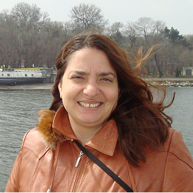
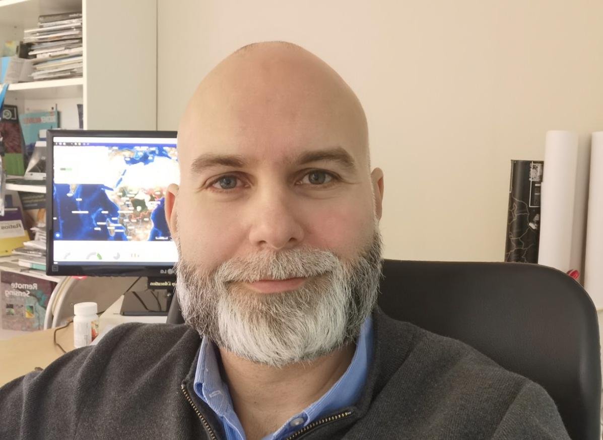
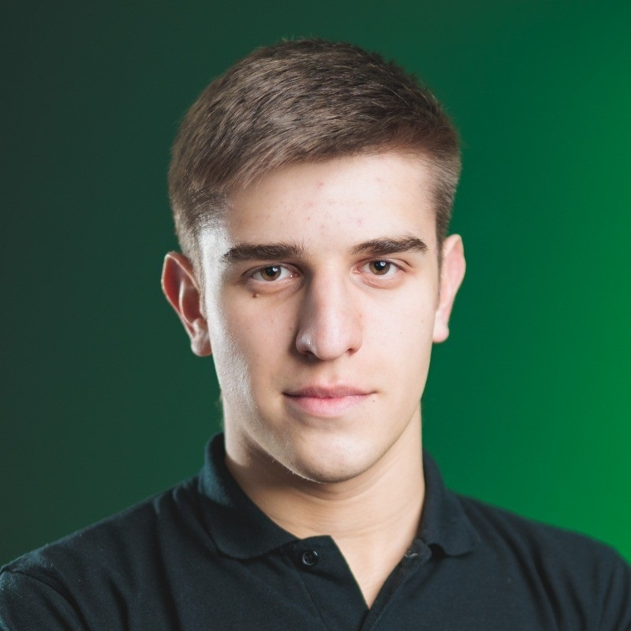
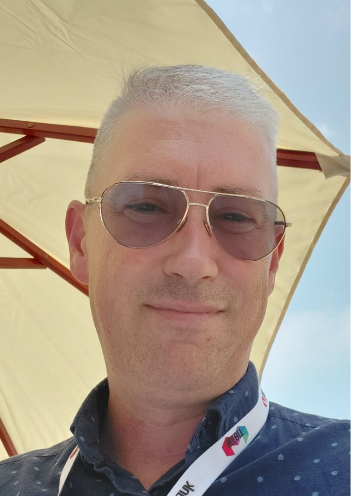
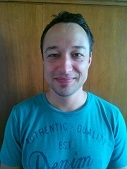
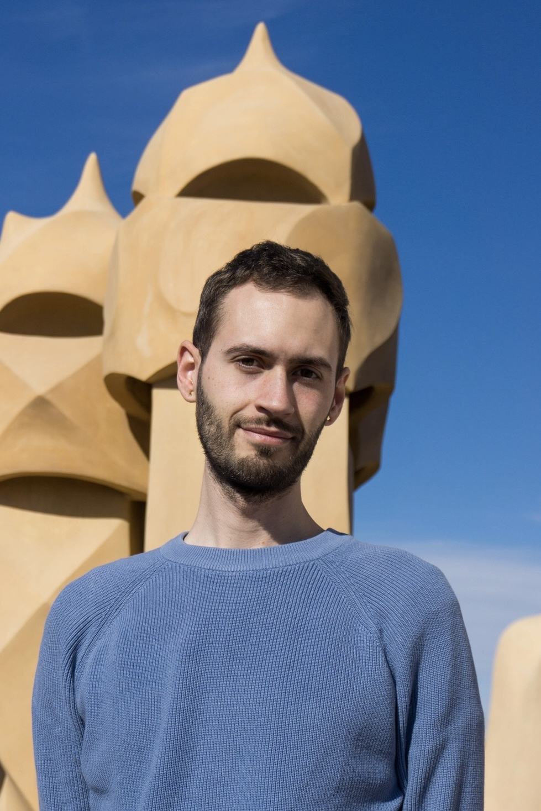
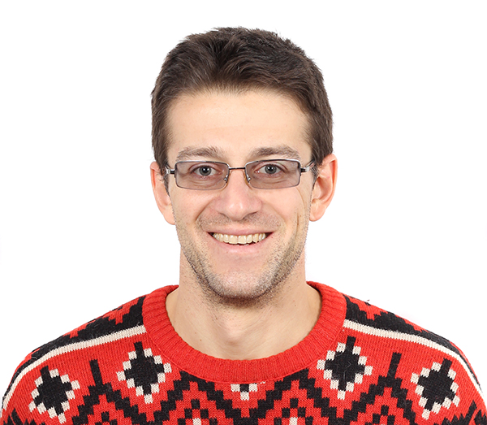
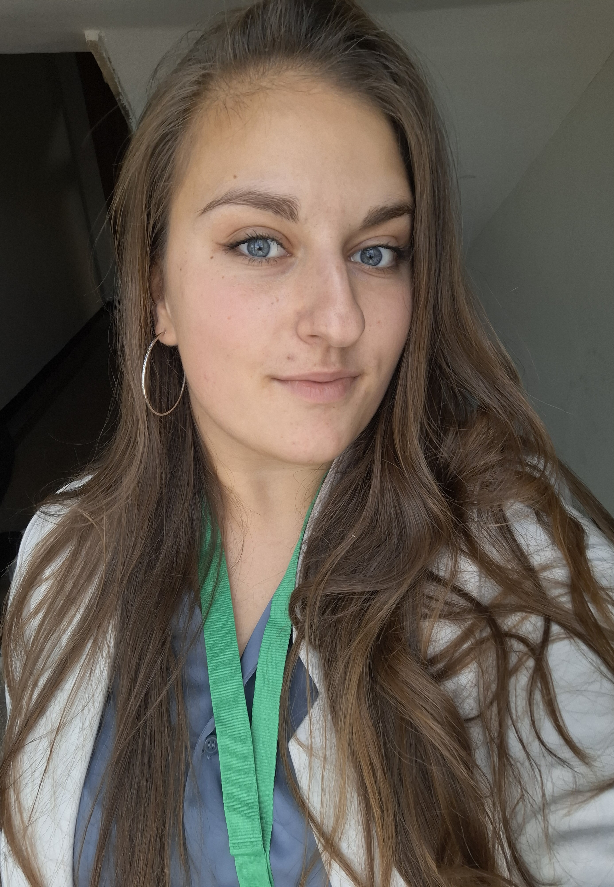
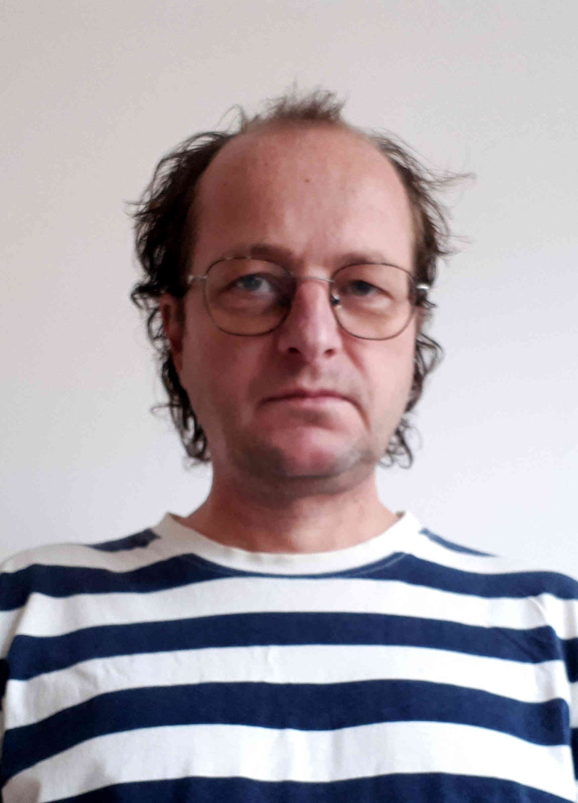

# FOSS4G:BG Отворена ГИС конференция 2025

|       |                                                                                                  |
|-------|--------------------------------------------------------------------------------------------------|
| дата  | 7-8 март 2025 г.                                                                                     |
| място | Аудитория 292 на Софийски университет „Св. Климент Охридски“                               |
| вход  | свободен                                                                                         |

Конференция за отворени и свободни географски информационни системи, отворени пространствени данни и отворени методи в дистанционните изследвания.

След успеха на [Отворената ГИС конференция през 2024 г.](./2024_foss4g_bg.md), на която 17 лектори представиха знанията, уменията и опита си пред над 160 души в препълнената Зала 1, организаторите се надяват да затвърдят новосъздалата се общност с ново събитие през 2025 г.

Конференцията е в разширен формат, в който освен представяния на лектори от различни сфери на професионална реализация, ще има и ден за работилници, в които начинаещи и напреднали ще могат не само да чуят, а реално да развият нови практически умения.

На 7 март 2025 г., петък, ще се проведат различни безплатни дву- и четиричасови работилници за развиване и усъвършенстване на знанията и уменията в сферата на отворените ГИС технологии със задълбочени практически занятия.

На 8 март 2025 г., събота, ще се проведе конференция с представяния на учени, професионалисти, разработчици и ентусиасти, които са изрично свързани с отворени и свободни географски технологии. Всяко представяне се вмества в твърди 15 минути и е последвано от 5 минути дискусия по темата.

Езикът на конференцията е български, неформален, лесноразбираем и не строго академичен.

Събитието като формат, замисъл и цели наподобява на добре установената практика на [FOSS4G](https://foss4g.org/), ежегодната конференция за отворен геопространствен софтуер, организирана от [OSGeo](https://osgeo.org/).

Целева група - професионалисти, студенти и ентусиасти.

Цел на събитието - популяризация на отворен ГИС и социализация на ГИС потребителите в България.

???+ warning "Внимание!"
    Съдържанието на тази страница подлежи на постоянно обновяване. За последните новини или мнения относно събитието, моля влез в [Телеграм канала](https://t.me/joinchat/Zxo__KwkcG5mMDU8) на QGIS.bg.

## Регистрация

Необходимо е попълване на кратък формуляр за предварителна регистрация за събитието. Регистрацията за работилници се [случва отделно тук](#7).

Избери някой от двата варианта за попълване на формуляра за регистрация:

=== "Попълни формуляра за регистрация в Google Forms"
    [Натисни тук, за да попълниш формуляра за регистрация](https://forms.gle/FmoyLEwmLmVHd6vz6){ .md-button .md-button--primary }

=== "Попълни формуляра за регистрация тук"
    <iframe src="https://docs.google.com/forms/d/e/1FAIpQLSf1qn9DR72tLUoC9bG2xXBYe6FfFJktNTXGOtsMTHJaFaP3ig/viewform?embedded=true" width="640" height="2676" frameborder="0" marginheight="0" marginwidth="0">Loading…</iframe>

???+ warning "Внимание"
    Ако си се регистрирал, но нямаш възможност да присъстваш, моля отпиши се с имейл на foss4g@qgis.bg.

## Комуникация

За въпроси, свързани със събитието, пиши на foss4g@qgis.bg.
Неформалната комуникация около събитието се случва в [Телеграм канала](https://t.me/joinchat/Zxo__KwkcG5mMDU8) на QGIS.bg.

## Програма

???+ info "Забележка"
    Моля, натиснете върху всяко индивидуално събитие за повече информация - начален и краен час, място, лектор, тема и абстракт.

<!-- ???+ warning "Внимание!"
    Подредбата и описанията на събитията подлежи на постоянни промени до започване на събитието. -->

<iframe src="https://calendar.google.com/calendar/embed?height=600&wkst=2&ctz=Europe%2FSofia&showPrint=0&mode=AGENDA&showCalendars=0&title=FOSS4G%3ABG%20%D0%9E%D1%82%D0%B2%D0%BE%D1%80%D0%B5%D0%BD%D0%B0%20%D0%93%D0%98%D0%A1%20%D0%BA%D0%BE%D0%BD%D1%84%D0%B5%D1%80%D0%B5%D0%BD%D1%86%D0%B8%D1%8F&hl=bg&showTabs=0&showNav=0&src=NGVhNGIxMTg1OGU5YTI4ZTdjZmY2NDI2YTQ3ODRhY2YyNDFhOTZhN2NjZTFhZDUxMDRiMDZhMzc5YzE1M2QzM0Bncm91cC5jYWxlbmRhci5nb29nbGUuY29t&color=%23EF6C00" style="border-width:0" width="100%" height="600" frameborder="0" scrolling="no"></iframe>

За вариант за печат на програмата, виж в [секцията "Рекламни материали"](#_29) по-долу.

### Вмъкване в собствен календар

Натисни върху връзката, за да добавиш календара към собствения си електронен календар:

[Натисни тук, за да добавиш календара](https://calendar.google.com/calendar/u/0?cid=NGVhNGIxMTg1OGU5YTI4ZTdjZmY2NDI2YTQ3ODRhY2YyNDFhOTZhN2NjZTFhZDUxMDRiMDZhMzc5YzE1M2QzM0Bncm91cC5jYWxlbmRhci5nb29nbGUuY29t){ .md-button .md-button--primary }

## Място

Конференцията ще се проведе в аудитория 292 на Ректората на Софийски университет „Св. Климент Охридски“. Залата е разположена на четвъртия етаж в Северното крило (откъм ул. „Шипка“) на сградата на Ректората. Може да се достъпи лесно както от Централния вход, така и от Задния вход, или Входа на Северното крило.

=== "Карта"
    <iframe src="//www.openstreetmap.org/export/embed.html?bbox=23.33212,42.69178,23.3383,42.69478&amp;layer=mapnik&amp;marker=42.69350,23.33530" width="100%" height="400" frameborder="0" scrolling="no" marginheight="0" marginwidth="0"></iframe>
=== "Схема"
    
=== "Навигация"
    <a href="http://maps.google.com/?daddr=Sofia+University">Отвори навигация</a>

## Работилници, 7 март, петък

Различни безплатни дву- и четиричасови работилници за развиване и усъвършенстване на знанията и уменията в сферата на отворените ГИС технологии със задълбочени практически занятия.

### Записване

Необходимо е попълване на кратък формуляр за предварителна регистрация за работилниците.

Избери някой от двата варианта за попълване на формуляра за регистрация:

=== "Попълни формуляра за регистрация в Google Forms"
    [Натисни тук, за да попълниш формуляра за регистрация за работилница](https://forms.gle/gnTBxz29PPJ1o6TM7){ .md-button .md-button--primary }
=== "Попълни формуляра за регистрация за работилница тук"
    <iframe src="https://docs.google.com/forms/d/e/1FAIpQLScYf6dwXkTQKJJ7zMnI9UhmDX-M-z34w-YAGpPg_xNfOV0SMA/viewform?embedded=true" width="640" height="2676" frameborder="0" marginheight="0" marginwidth="0">Loading…</iframe>

### Работилници

В тази секция ще откриеш лекторите на работилниците, подредени по азбучен ред, както и връзки към техните профили в интернет пространството. На следващия ред е заглавието на работилницата, а в сиво е абстрактът.

#### Евгения Сарафова [:material-linkedin:](https://www.linkedin.com/in/evgeniasarafova/)

{: style="width:300px"}

**ГИС за начинаещи - основи на работата с QGIS**

> По време на работилницата участниците ще научат откъде и как да инсталират софтуера, какви са особеностите за работа с него и как да добавят данни от различни източници.
> Ще използваме данни от официални източници в България (агенции, министерства), както и международни такива. Ще разберете и как можете да сваляте и работите с данни от OpenStreetMap, директно в QGIS.

---

Доц. д-р Евгения Сарафова е преподавател в Геолого-географския факултет на СУ „Св. Климент Охридски“. Работи с ГИС от над 20 г. и вярва, че една от основните движещи сили на обществото днес е именно отварянето на все повече продукти, услуги и данни.

| Допълнителна информация                        |                                                 |
|------------------------------------------------|-------------------------------------------------|
| Продължителност                                | 2 часа                                          |
| Необходими допълнителни материали              | Компютър с възможност за инсталиране на софтуер |
| Очаквани ГИС познания                          | Няма                                            |
| Препоръчителни минимални знания на участниците | Базова компютърна грамотност                    |
| За каква аудитория е подходяща работилницата?  | Ученици, Студенти, Ентусиасти                   |

#### Елисавета Пенева

{: style="width:300px"}

**OpenGrads**

> Grid Analysis and Display System (GrADS) е интерактивен графичен инструмент за лесен достъп, манипулиране и визуализиране на данни от околната среда. Проектът OpenGrADS се стреми да разработи усъвършенствани интерфейси за крайния потребител, базирани на основния двигател на GrADS. Силата на софтуера се крие в работата с данни от големи файлове в netcdf и grib формати.

---

Доц. д-р Елисавета Пенева работи във Физически факултет на СУ „Св. Климент Охридски“ от 2001 г., като преподава „Физика на климата“ и „Дистанционни методи за наблюдение на Земята от Космоса“. Научните й интереси са в областта на численото моделиране на океана и атмосферата, със специфичен фокус върху Черно море и Балканския полуостров.

| Допълнителна информация                        |                                                            |
|------------------------------------------------|------------------------------------------------------------|
| Продължителност                                | 2 часа                                                     |
| Необходими допълнителни материали              | Компютър с възможност за инсталиране на софтуер            |
| Очаквани ГИС познания                          | Минимални                                                  |
| Препоръчителни минимални знания на участниците | Базови знания за форматите на данни в атмосферата и океана |
| За каква аудитория е подходяща работилницата?  | Студенти, Ентусиасти                                       |

#### Иван Иванов [:material-linkedin:](https://www.linkedin.com/in/suricactus/)

{: style="width:300px"}

**QField и QFieldCloud - събиране на данни на терен**

> В работилницата ще се запознаем с процеса на създаване и настройка на проект за работа с QField и QFieldCloud за събиране на теренни данни, както и с особеностите на теренната работа.
> QField е мобилно приложение с отворен код, което помага за събиране на данни директно от центъра на събитията, при това с перфектна интеграция с QGIS.

---

Иван Иванов е [разработчик на ГИС софтуер с отворен код като QGIS, QField и QFieldCloud](https://github.com/suricactus/), [член на световната OSGeo организация](https://www.osgeo.org/member/ivanov/) и основател на онлайн платформата QGIS.bg, чиято цел е популяризиране на FOSS4G сред българските потребители.

| Допълнителна информация                        |                                                            |
|------------------------------------------------|------------------------------------------------------------|
| Продължителност                                | 3 часа                                                     |
| Необходими допълнителни материали              | Компютър с възможност за инсталиране на софтуер            |
| Очаквани ГИС познания                          | Няма                                                       |
| Препоръчителни минимални знания на участниците | Минимилни умения в QGIS                                    |
| За каква аудитория е подходяща работилницата?  | Ученици, Студенти, Профоесионалисти, Ентусиасти            |

#### Любомир Филипов [:material-linkedin:](https://www.linkedin.com/in/lubomirfilipov/)

{: style="width:300px"}

**Geonode - въведение и уеб ГИС забавление**

> Ще разгледаме подробно интерфейса на Geonode, като един от най-разпространените портали за геоданни. Ще качваме данни, ще говорим за Уеб ГИС услуги, за метаданни, ще създадем Уеб ГИС приложение, сторимапс, дашбоарди. Ще обсъдим софтуерната архитектура и ще разгледаме малко Геосървър, ще се свържем към Postgre/PostGIS база данни през QGIS. Ще си поговорим за оперативна съвместимост (WMS/WFS/CSW). Работилницата е насочена към начинаещи потребители, изисква се лаптоп, добре е да има QGIS инсталиран (но познания не са задължителни), добре е да знаете какво е "ГИС", но и това не е задължително.

---

Любо Филипов е Магистър по ГИС и Картография от СУ, консултант в редица национални и международни проекти в над 30 държави, с организации като Европейската комисия, Световна Банка, ООН, JICA, OSCE, UNFPA и много други. Внедрявал е Geonode в басейнови дирекции, Национален Парк Рила, регионални портали (Беларус, Азербайджан, Украйна, Молдова, Грузия, Армения) до глобален ООН портал за над 150 държави.

| Допълнителна информация                        |                                                                |
|------------------------------------------------|----------------------------------------------------------------|
| Продължителност                                | 4 часа                                                         |
| Необходими допълнителни материали              | Компютър с възможност за инсталиране на софтуер                |
| Очаквани ГИС познания                          | Няма                                                           |
| Препоръчителни минимални знания на участниците | Mинимални познания по ГИС                                      |
| За каква аудитория е подходяща работилницата?  | Ученици, Студенти, Специалисти, работещи в сферата, Ентусиасти |

#### Николай Найденов и Яна Липийска

{: style="width:300px"}

**Изобразяване на релеф**

> Изобразяването на релефа е съществена част при изработката на карти, особено ако искаме да са красиви. За целта трябва да знаем, от къде може да намерим данни със свободен достъп за релефа (DTM), как да ги обработим, така че да получим атрактивни теренни карти. Ще се научим как се генерират и надписват добре изгладени хоризонтали, как се прави хипсометрично оцветяване в различни цветови палитри и драматични светлосенки. Естествено на QGIS.

---

Гл. ас. д-р инж. Николай Найденов преподава картография и ГИС в университета по архитектура, строителство и геодезия, вече 25 години. Здраво е прегърнал идеята за свободните данни и свободния софтуер. От 2015 г. проповядва в лекции, упражнения, семинари, обучения точно тази идея. Участвал е в много проекти и инициативи в обществения и частен сектор с използване на отворени данни и QGIS.

Гл. ас. д-р инж. Яна Липийска е преподавател в УАСГ. Занимава се с ГИС професионално от много години.
В последните години преподава на студентите всичко, свързано с ГИС и Картография, само на QGIS.

| Допълнителна информация                        |                                                                |
|------------------------------------------------|----------------------------------------------------------------|
| Продължителност                                | 3 часа                                                         |
| Необходими допълнителни материали              | Компютър с възможност за инсталиране на софтуер                |
| Очаквани ГИС познания                          | Няма                                                           |
| Препоръчителни минимални знания на участниците | Базови знания за QGIS                                          |
| За каква аудитория е подходяща работилницата?  | Ученици, Студенти, Специалисти, работещи в сферата, Ентусиасти |

#### Теодора Колева [:material-linkedin:](https://www.linkedin.com/in/teodora-koleva-4939aa2b4/) и Денис Урумов [:material-linkedin:](https://www.linkedin.com/in/denis-urumov-a960511aa/)

{: style="width:300px; display: inline-block;"}
{: style="width:300px; display: inline-block;"}

**Силата на символите**

> Символогията е един от най-важните елементи при създаването на карти.
> Включете се в нашата работилница, за да се запознаете с широкия набор от възможности за прилагане на симвология, визуализиране на количествени данни и създаване на различни видове карти в QGIS.

---

Теодора Колева е студент четвърти курс в ГГФ, специалност “Геопространствени системи и технологии”. Обучава се в Университета в Падова, Италия за един семестър по програмата "Еразъм". Доброволец в QGIS.bg, член на световната OSGeo организация и ГИС ентусиаст.

Денис Урумов е студент по География във Виенския университет в Австрия и ГИС ентусиаст. В 10-ти клас за пръв път се запознава с възможностите на отворените и свободните географски информационни системи. През годините е участвал в различни конкурси по картография и визуализация на данни.

| Допълнителна информация                        |                                                                |
|------------------------------------------------|----------------------------------------------------------------|
| Продължителност                                | 2 часа                                                         |
| Необходими допълнителни материали              | Компютър с възможност за инсталиране на софтуер                |
| Очаквани ГИС познания                          | Няма                                                           |
| Препоръчителни минимални знания на участниците | Базови QGIS познания                                           |
| За каква аудитория е подходяща работилницата?  | Ученици, Студенти, Специалисти, работещи в сферата, Ентусиасти |

## Конференция, 8 март, събота

В тази секция ще откриеш лекторите на конференцията, подредени по азбучен ред, както и връзки към техните профили в интернет пространството. На следващия ред е заглавието на лекцията, а в сиво е абстрактът.

### Денис Урумов

{: style="width:300px"}

**QGIS базирана класификация на българските градски и селски райони чрез прилагане на австрийската типология**

> Направен е опит за прилагането на австрийската градско-селска типология за България чрез QGIS. Накратко ще бъдат очертани основните стъпки и параметри на Statistik Austria за разграничаване на отделните райони. Присъстващите ще бъдат запознати с практическото изпълнение в QGIS - откъде могат да се изтеглят нужните данни, кои плъгини са необходими за подобни (както и други) анализи. Накрая ще бъдат представени резултатите от класификацията.

---

Денис Урумов е студент по География във Виенския университет в Австрия и ГИС ентусиаст. В 10-ти клас за пръв път се запознава с възможностите на отворените и свободните географски информационни системи. През годините е участвал в различни конкурси по картография и визуализация на данни.

### Димитър Коритаров

{: style="width:300px"}

**История на ГИС в България. Минало, настояще и бъдеще.**

> Проследява историята на дигитализацията на кадастралните данни, устройствената пространствената информация и подземните проводи и съоръжения в едно с първите легални, законови действия от страна на правителството, да стартира процеса по дигитализация в България. Ще има кратка резюме на текущите тенденции за използването на тези данни в наши дни и няколко хипотези за развитието на ГИС вбъдеще в комбинация с последните технологии.

---

Има над 26 години опит в сферата на ГИС системите. инж. геодезист с опит както в държавния, така и частния сектор. Участие в десетки големи ГИС проекти свързани с ключови министерства, агенции и държавни компании.

### Димитър Тасев

**OpenStreetMap: Силата на отворените карти и как можем да допринесем за тяхното създаване**

>OpenStreetMap е картата, която създаваш с всяка стъпка – дали се разхождаш по пешеходни алеи, преминаваш през железопътни линии, изследваш градската джунгла или се наслаждаваш на природата около теб. В тази презентация ще видим как всеки може да добави към картата всичко – от уютни паркове и велосипедни алеи, до железопътни мрежи и земеползване, използвайки лесни и забавни инструменти като iD, JOSM и Vespucci. OpenStreetMap е твоята възможност да направиш света по-достъпен и да допринесеш за картографирането на пътища, природа и градска среда – просто като оставиш следа с всяка стъпка!

---

Авторът на тази презентация е ентусиаст в областта на географските информационни системи (ГИС) и отворени данни, с три-четири години опит в OpenStreetMap (OSM). Като студент във Факултета по математика и информатика (ФМИ), той/тя се интересува от разработване на проекти, свързани със свободния достъп до географски данни и картографирането.

### Евгения Сарафова [:material-linkedin:](https://www.linkedin.com/in/evgeniasarafova/)

{: style="width:300px"}

**Learn QGIS, 5th Edition - новата книга с български автори**

>В презентацията ще научите подробности за създаването на петото издание на една от най-популярните книги в света - Learn QGIS, 5th Edition. За следващото издание от тази поредица на издателство Packt работи в основната си част екип от българи, съвместно с колеги от цял свят.

---

**Гигантски карти с QGIS - мисията възможна**

>Тази презентация ще покаже как QGIS може да бъде използван за проектиране на естетически приятни карти, които да обогатят интериора на учебните класни стаи в училища и други образователни институции. Ще бъдат разгледани различни техники и подходи за визуализация, които могат да бъдат прилагани чрез софтуера, за да се създадат картографски изображения, които не само подпомагат образователния процес, но също така допринасят за визуално привлекателна учебна среда.

---

Доц. Евгения Сарафова е преподавател в Геолого-географския факултет на СУ „Св. Климент Охридски“. Работи с ГИС от над 20 г. и вярва, че една от основните движещи сили на обществото днес е именно отварянето на все повече продукти, услуги и данни.

### Златомир Димитров

{: style="width:300px"}

**Landscapemetrics.eu: геопортал базиран на уеб-ГИС технологии с отворен код**

> Гепорталът Landscapemetrics.eu, базиран на уеб-ГИС технологии с отворен код, представя новаторски подход в анализа и визуализацията на ландшафтните характеристики. Този инструмент съчетава традиционни методи за оценка на ландшафтната екология с модерни уеб технологии, предоставяйки възможности за детайлен и интуитивен анализ на геопространствените данни. Използването на отворен код не само улеснява адаптирането и персонализирането на системата, но и насърчава сътрудничеството и обмена на опит между изследователи и специалисти в областта.

> В контекста на динамично развиващата се научна и технологична среда, гепорталът е пример за това как традиционните методи и новите технологични възможности могат да се интегрират за създаването на мощни инструменти за анализ. Представянето ще акцентира върху методологията, използваните технологии, като същевременно подчертава значението на отворения софтуер за насърчаване на иновациите и устойчивото развитие в науката. Геопорталът се изгражда по Рамковото партньорско споразумение "Каролин Хершел" на Европейския съюз за потребителите на Copernicus, съгласно споразумение за субсидии № FPA 275/G/GRO/COPE/17/10042, проект FPCUP (Рамково партньорско споразумение на потребителите на Copernicus), Действие 2021-2-38. Използване на услугите Copernicus от страна на заинтересованите страни в областта на ландшафтното и пространственото планиране (Специфично споразумение за субсидии №20 - 2022/SI2.879178-SI2.879180/20).
>
> Автори: Златомир Димитров, Любомир Филипов, Лъчезар Филчев, Камелия Радева

---

Гл. ас. д-р Златомир Димитров от ИКИТ-БАН е специалист с богат опит в областта на дистанционните методи от Космоса, като основните му изследователски интереси включват обработка на SAR данни, поляриметрия и интерферометрия, както и разработване на сървърни технологии за уеб-ГИС. Той активно участва в научни проекти, свързани с мониторинг на земеделски посеви и устойчивото управление на околната среда, като неговата работа съчетава традиционни подходи с иновативни технологични решения.

### Иван Иванов [:material-linkedin:](https://www.linkedin.com/in/suricactus/)

{: style="width:300px"}

**QField - данните са на терен**

> Съвременните технологии позволяват да виждаме светът от космоса, да получаваме пространствени обекти от отдалечени сървъри, интернетът на нещата да изпраща данни на живо от сензори. Но рано или късно, ние трябва да съберем или валидираме теренни данни.

> QField е мобилно приложение с отворен код, което помага за събиране на данни директно от центъра на събитията, при това с перфектна интеграция с QGIS. Защото QField e QGIS с адаптиран за мобилни устройства интерфейс.

---

Иван Иванов е [разработчик на ГИС софтуер с отворен код като QGIS, QField и QFieldCloud](https://github.com/suricactus/), [член на световната OSGeo организация](https://www.osgeo.org/member/ivanov/) и основател на онлайн платформата QGIS.bg, чиято цел е популяризиране на FOSS4G сред българските потребители.

### Любомир Радков

{: style="width:300px"}

**Изграждане на подходящия инструмент за градоустройствено планиране**

> Главната тема на презентацията е изготвянето на цялостно решение за стандартизиране и автоматизиране на методики, чрез технически подходи и добра комуникация между експертите в градоустройственото планиране и информационните технологии. Ще разгледаме пътят за внедряване и изграждане на подобни инструменти и спънките срещнати по него.

---

Любомир Радков е архитект по образование, но софтуерен разработчик по професия. Има дългогодишен опит в автоматизирането на процеси в проектантската и производствената дейност. От 2021 година е част от екипа на ОП „Софияплан“ и разработва ГИС решения.

### Любомир Филипов [:material-linkedin:](https://www.linkedin.com/in/lubomirfilipov/)

{: style="width:300px"}

**Пространствени технологии за по-добър свят: ГИС в едно от най-уникалните географски места**

> Едно от най-отдалечените и слабо посещавани места на планетата. ГИС и то с отворен код. Без багаж и храна, но с QGIS и бира всичко се постига. Ще говоря за свободни данни в хуманитарната сфера, за местни предизвикателства и интересни факти, за динамика на населението и как е нормално хората да имат повече от едно име (и свързаните с това кошмари от информационна гледна точка). Забавен ГИС-пътепис :)

---

Любо Филипов е Магистър по ГИС и Картография от СУ, консултант в редица национални и международни проекти в над 30 държави, с организации като Европейската комисия, Световна Банка, ООН, JICA, OSCE, UNFPA и много други. Внедрявал е Geonode в басейнови дирекции, Национален Парк Рила, регионални портали (Беларус, Азербайджан, Украйна, Молдова, Грузия, Армения) до глобален ООН портал за над 150 държави.

### Николай Дунев

{: style="width:300px"}

**Историята и QGIS**

>Приложението на QGIS в създаването на динамични исторически карти - проблеми, предизвикателства и резултати.

---

Юрист по образование, но със силни интереси към историята и старите карти. Колекционер на стари карти, но целящ да осъвремени историята.

### Николай Найденов

{: style="width:300px"}

**Туристическа карта "Странджа - пеша и с колело"**

> Представяне на новата подробна карта на Странджа, изработена изцяло с QGIS. На нея са нанесени всички маркирани туристически маршрути, населени места, защитени територии, църкви, параклиси, светилища, долмени, заслони и всички забележителности и обекти, свързани с планината.

---

Гл. ас. д-р инж. Николай Найденов преподава картография и ГИС в университета по архитектура, строителство и геодезия, вече 25 години. Здраво е прегърнал идеята за свободните данни и свободния софтуер. От 2015 г. проповядва в лекции, упражнения, семинари, обучения точно тази идея. Участвал е в много проекти и инициативи в обществения и частен сектор с използване на отворени данни и QGIS.

### Теодора Колева [:material-linkedin:](https://www.linkedin.com/in/teodora-koleva-4939aa2b4/)

{: style="width:300px"}

**GeoChicas - жените в ГИС средите**

> Настоящето представяне цели да запознае аудиторията с организацията GeoChicas по повод Международния ден на жената.

> GeoChicas (джиочикас) е международна женска картографска общност с членове в повече от 12 различни държави. Целта им е жените да имат по-голямо присъствие и участие в ключови събития на OpenStreetMap, да увеличат женското участие и лидерство и да работят по картографски проекти, които са от полза на жените.

---

Теодора Колева е студент четвърти курс в ГГФ, специалност “Геопространствени системи и технологии”. Обучава се в Университета в Падова, Италия за един семестър по програмата "Еразъм". Доброволец в QGIS.bg, член на световната OSGeo организация и ГИС ентусиаст.

### Яна Петрова

{: style="width:300px"}

**Използване на свободни данни в обучението по Картография и ГИС в УАСГ**

> Ще надникнем в особеностите на обучението по Картография и ГИС в Университетът по архитектура, строителство и геодезия.

---

Студентка от 4-ти курс, специалност Геодезия в УАСГ.

### Янко Герджиков

{: style="width:300px"}

**Предизвикателства и подходи при актуализирането на съществуващи геоложки карти в средата на QGIS**

> Редица причини налагат непрекъснатата актуализация на съществуващите геоложки карти. Поради липсата на геоложка служба, тази задача се изпълнява в рамките на научни проекти. В процеса на работа се сблъскваме с редица проблеми, като недостатъчно налични дигитални данни и нуждата от гъвкави подходи при изготвянето на карти в различни мащаби. Дискутират се различни методични подходи и важното значение да се работи с топологично изрядни данни.

---

Проф. д-р Янко Герджиков е член на катедра “Регионална геология, структурна геология и геотектоника” в Геолого-географския факултет на СУ „Св. Климент Охридски“.

## Как да водя работилница?

Ако желаеш да водиш работилница на 7 март, петък, попълни формуляра за участие не по-късно от 23 февруари 24:00.

[Заяви водене на работилница](https://forms.gle/kdnC214rY6WKdjw28){ .md-button .md-button--primary }

Залите, в които ще се проведат работилниците, ще разполагат с мултимедия, екран, интернет връзка и разклонители, но останалите пособия трябва да се осигурят от заявилия водене на работилница и участниците, като компютри, инсталация на софтуер, включително компютър за водещия.

Може да се заявят повече от една работилници от един и същи лектор.

Организаторите си запазват правото да откажат регистрираната работилница, за което заявилият ще бъде надлежно уведомен.

## Как да стана лектор на конференцията?

Ако желаеш да водиш представяне на 8 март, събота, попълни формуляра за участие не по-късно от 23 февруари 24:00.

[Заяви водене на представяне](https://forms.gle/4NiLpK6koLNGhK5L7){ .md-button .md-button--primary }

Залата, в която ще се водят представянията, ще разполага с мултимедия, екран, интернет връзка и компютър, на който предварително ще са качени представянията.

Заявилият лектор на конференцията трябва да предостави на 6 март `.pdf` с представянето на имейл foss4g@qgis.bg. Получаването на представяния в деня на конференцията няма да се приема, както и участието на лектор с импровизация по време на представянето.

Организаторите си запазват правото да откажат регистрираното представяне, за което заявилият ще бъде надлежно уведомен.

## Откъде да взема рекламни материали за събитието?

Рекламни материали за събитието можеш да вземеш от тук:

### Плакат на събитието
<!-- QR code generated with https://www.qrcode-monkey.com -->
- [2025_foss4gbg_osm_v3.png](./docs/2025_foss4gbg_osm_v3.png)
- [2025_foss4gbg_osm_v3.pdf](./docs/2025_foss4gbg_osm_v3.pdf)
- [2025_foss4gbg_osm_v3.svg](./docs/2025_foss4gbg_osm_v3.svg) - Inkscape

### Програма на работилници

- [2025_foss4gbg_programme_07_v4.png](./docs/2025_foss4gbg_programme_07_v4.png)
- [2025_foss4gbg_programme_07_v4.pdf](./docs/2025_foss4gbg_programme_07_v4.pdf)
- [2025_foss4gbg_programme_07_v4.svg](./docs/2025_foss4gbg_programme_07_v4.svg) - Inkscape

### Програма на конференцията

- [2025_foss4gbg_programme_08_v3.png](./docs/2025_foss4gbg_programme_08_v3.png)
- [2025_foss4gbg_programme_08_v3.pdf](./docs/2025_foss4gbg_programme_08_v3.pdf)
- [2025_foss4gbg_programme_08_v3.svg](./docs/2025_foss4gbg_programme_08_v3.svg) - Inkscape

## Ще публикувате ли материалите някъде?

Да, ще ги публикуваме тук.
Всички материали на лекторите ще се разпространят безплатно след края на събитието.

## Как да помогна?

Пиши на foss4g@qgis.bg или се включи в [Телеграм канала](https://t.me/joinchat/Zxo__KwkcG5mMDU8) на QGIS.bg и предложи помощта си.

## Какво са "светкавичките" ⚡️?

Светкавичките са формат на кратко представяне на идея, технология или проект, която се вмества в 5 минути. "Светкавичка" е опит за превод на "lightning talk", понякога се превежда и като "блицдоклад".

Всеки може да заяви светкавичка по време на конференцията на 8 март.

## Задачи и срокове

- 2025-02-06 24:00 (четвъртък): Разгласяване на събитието.
- 2025-02-23 24:00 (неделя): Край на получаване на заявки за водене на работилници или лекции.
- 2025-02-28 24:00 (петък): Потвърждение до лекторите за участие от организаторите.
- 2025-02-28 24:00 (петък): Финализирана програма.
- 2025-03-05 24:00 (четвъртък): Край на заявяване на участие в работилници.
- 2025-03-06 24:00 (четвъртък): Край на изпращане на представяния като `pdf` от лектори.
- 2025-03-07 09:00 (петък): Работилници.
- 2025-03-08 09:00 (събота): Конференция.
- 2025-03-08 18:00 (събота): Неформална социализация.
