# FOSS4G:BG Отворена ГИС конференция 2026

|       |                                                                                                  |
|-------|--------------------------------------------------------------------------------------------------|
| дата  | 5-6 март 2026 г.                                                                                     |
| конференция | Аудитория 243 на Ректората на Софийски университет „Св. Климент Охридски“                               |
| работилници | Зала 1 и 2 на Ректората на Софийски университет „Св. Климент Охридски“                               |
| вход  | свободен                                                                                         |

<iframe width="560" height="315" src="https://www.youtube.com/embed/HZ_j3H8JR5g?si=CXziZjjkImzQZahg" title="YouTube video player" frameborder="0" allow="accelerometer; autoplay; clipboard-write; encrypted-media; gyroscope; picture-in-picture; web-share" referrerpolicy="strict-origin-when-cross-origin" allowfullscreen></iframe>

Конференция за отворени и свободни географски информационни системи, отворени пространствени данни и отворени методи в дистанционните изследвания.

След успеха на [Отворената ГИС конференция през 2024 г.](./2024_foss4g_bg.md) и [Отворената ГИС конференция през 2025 г.](./2025_foss4g_bg.md), организаторите се надяват да затвърдят новосъздалата се общност с поредното събитие през 2026 г.

Конференцията е в разширен формат, в който освен представяния на лектори от различни сфери на професионална реализация, ще има и ден за работилници, в които начинаещи и напреднали ще могат не само да чуят, а реално да развият нови практически умения.

На 5 март 2026 г., четвъртък, ще се проведат различни безплатни дву- и четиричасови работилници за развиване и усъвършенстване на знанията и уменията в сферата на отворените ГИС технологии със задълбочени практически занятия.

На 6 март 2026 г., петък, ще се проведе конференция с представяния на учени, професионалисти, разработчици и ентусиасти, които са изрично свързани с отворени и свободни географски технологии. Всяко представяне се вмества в твърди 15 минути и е последвано от 5 минути дискусия по темата.

Езикът на конференцията е български, неформален, лесноразбираем и не строго академичен.

Събитието като формат, замисъл и цели наподобява на добре установената практика на [FOSS4G](https://foss4g.org/), ежегодната конференция за отворен геопространствен софтуер, организирана от [OSGeo](https://osgeo.org/).

Целева група - професионалисти, студенти и ентусиасти.

Цел на събитието - популяризация на отворен ГИС и социализация на ГИС потребителите в България.

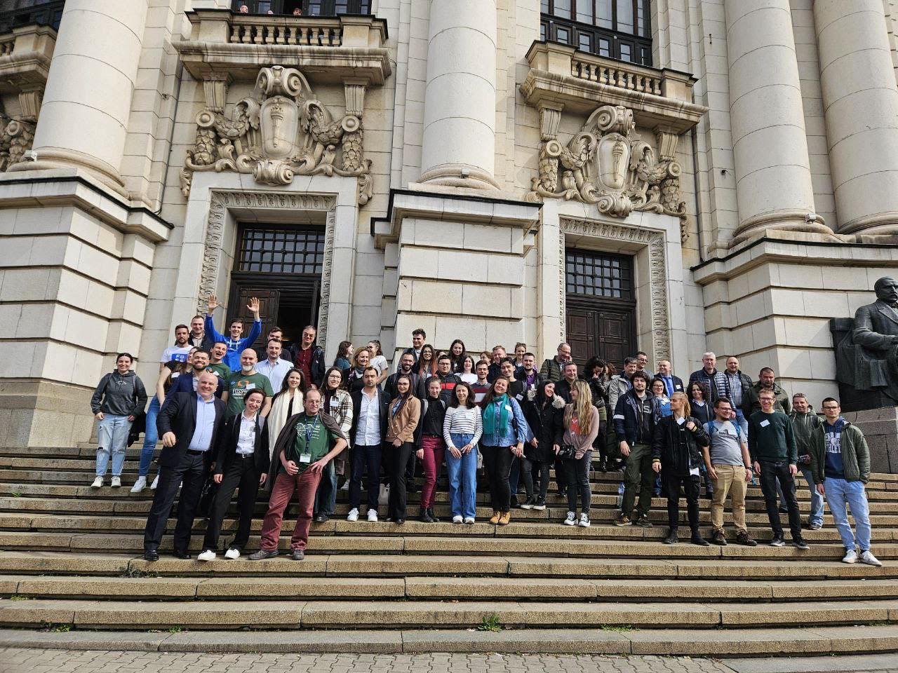

???+ warning "Внимание!"
    Съдържанието на тази страница подлежи на постоянно обновяване. За последните новини или мнения относно събитието, моля влез в [Телеграм канала](https://t.me/joinchat/Zxo__KwkcG5mMDU8) на QGIS.bg.

## Регистрация

Необходимо е попълване на кратък формуляр за предварителна регистрация за събитието. Регистрацията за работилници се [случва отделно тук](#5).

Избери някой от двата варианта за попълване на формуляра за регистрация:

=== "Попълни формуляра за регистрация в Google Forms"
    [Натисни тук, за да попълниш формуляра за регистрация](https://forms.gle/SvyFJvM4VhbDaTjf6){ .md-button .md-button--primary }

=== "Попълни формуляра за регистрация тук"
    <iframe src="https://forms.gle/SvyFJvM4VhbDaTjf6" width="640" height="2676" frameborder="0" marginheight="0" marginwidth="0">Loading…</iframe>

???+ warning "Внимание"
    Ако си се регистрирал, но нямаш възможност да присъстваш, моля отпиши се с имейл на foss4g@qgis.bg.

## Комуникация

За въпроси, свързани със събитието, пиши на foss4g@qgis.bg.
Неформалната комуникация около събитието се случва в [Телеграм канала](https://t.me/joinchat/Zxo__KwkcG5mMDU8) на QGIS.bg.

## Програма

???+ info "Забележка"
    Моля, натиснете върху всяко индивидуално събитие за повече информация - начален и краен час, място, лектор, тема и абстракт.

<!-- ???+ warning "Внимание!"
    Подредбата и описанията на събитията подлежи на постоянни промени до започване на събитието. -->

<iframe src="https://calendar.google.com/calendar/embed?height=600&wkst=2&ctz=Europe%2FSofia&showPrint=0&mode=AGENDA&showCalendars=0&title=FOSS4G%3ABG%20%D0%9E%D1%82%D0%B2%D0%BE%D1%80%D0%B5%D0%BD%D0%B0%20%D0%93%D0%98%D0%A1%20%D0%BA%D0%BE%D0%BD%D1%84%D0%B5%D1%80%D0%B5%D0%BD%D1%86%D0%B8%D1%8F&hl=bg&showTabs=0&showNav=0&src=NGVhNGIxMTg1OGU5YTI4ZTdjZmY2NDI2YTQ3ODRhY2YyNDFhOTZhN2NjZTFhZDUxMDRiMDZhMzc5YzE1M2QzM0Bncm91cC5jYWxlbmRhci5nb29nbGUuY29t&color=%23EF6C00" style="border-width:0" width="100%" height="600" frameborder="0" scrolling="no"></iframe>

За вариант за печат на програмата, виж в [секцията "Рекламни материали"](#_29) по-долу.

### Вмъкване в собствен календар

Натисни върху връзката, за да добавиш календара към собствения си електронен календар:

[Натисни тук, за да добавиш календара](https://calendar.google.com/calendar/u/0?cid=NGVhNGIxMTg1OGU5YTI4ZTdjZmY2NDI2YTQ3ODRhY2YyNDFhOTZhN2NjZTFhZDUxMDRiMDZhMzc5YzE1M2QzM0Bncm91cC5jYWxlbmRhci5nb29nbGUuY29t){ .md-button .md-button--primary }

## Място

Конференцията ще се проведе в аудитория 243 на Ректората на Софийски университет „Св. Климент Охридски“.
Залата е разположена на втория етаж в Северното крило (откъм ул. „Шипка“) на сградата на Ректората.
Може да се достъпи лесно както от Централния вход, така и от Задния вход, или Входа на Северното крило.

Работилниците ще се проведат в Зала 1 и Зала 2 на Южното крило на Ректората на Софийски университет „Св. Климент Охридски“.

=== "Карта"
    <iframe src="//www.openstreetmap.org/export/embed.html?bbox=23.33212,42.69178,23.3383,42.69478&amp;layer=mapnik&amp;marker=42.69350,23.33530" width="100%" height="400" frameborder="0" scrolling="no" marginheight="0" marginwidth="0"></iframe>
=== "Схема"
    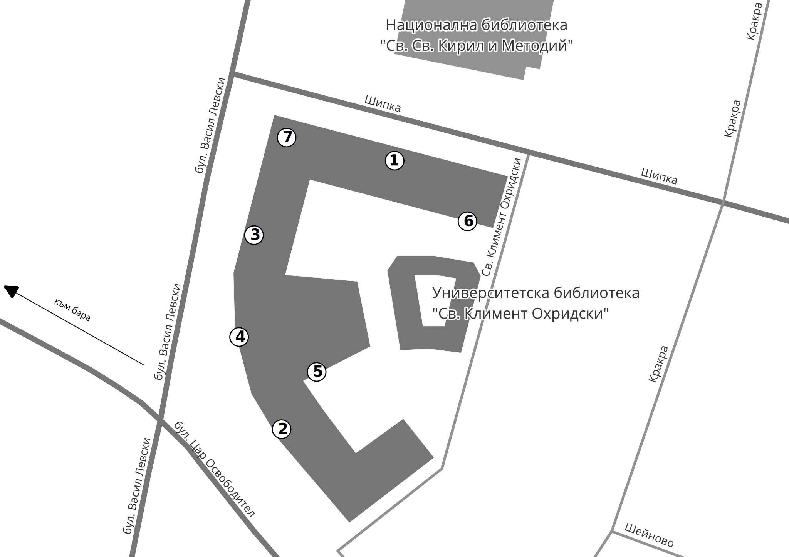
=== "Навигация"
    <a href="http://maps.google.com/?daddr=Sofia+University">Отвори навигация</a>

## Работилници, 5 март, четвъртък

Различни безплатни дву- и четиричасови работилници за развиване и усъвършенстване на знанията и уменията в сферата на отворените ГИС технологии със задълбочени практически занятия.

### Записване за работилници

Необходимо е попълване на кратък формуляр за предварителна регистрация за работилниците.

Избери някой от двата варианта за попълване на формуляра за регистрация:

=== "Попълни формуляра за регистрация в Google Forms"
    [Натисни тук, за да попълниш формуляра за регистрация за работилница](https://forms.gle/iS6P4KCZ6MyZGdMi7){ .md-button .md-button--primary }
=== "Попълни формуляра за регистрация за работилница тук"
    <iframe src="https://forms.gle/iS6P4KCZ6MyZGdMi7" width="640" height="2676" frameborder="0" marginheight="0" marginwidth="0">Loading…</iframe>

### Работилници

В тази секция ще откриеш лекторите на работилниците, подредени по азбучен ред, както и връзки към техните профили в интернет пространството. На следващия ред е заглавието на работилницата, а в сиво е абстрактът.

#### Димитър Тасев

**От пейката до подлеза: картографиране на нещата, които GPS-ът ви премълчава**

>Всички сме били там - навигацията казва „пристигнахте“, а вие сте насред паркинг без вход. В този двучасов мапатон ще се гмурнем в детайлите на OpenStreetMap и ще добавяме онези малки, но критични неща: входове, пътеки, пейки, рампи, велостойки и други герои в сянка.
>Ще си говорим за добри практики, за това как да не създадем „криво езеро с форма на кроасан“ и как да направим картата по-полезна за реални хора - включително за пешеходци, колоездачи и хора с намалена подвижност. Няма да местим планини, но може да оправим някой подлез.

---

Димитър Тасев е ентусиаст в областта на географските информационни системи и отворените данни с няколкогодишен активен опит в OpenStreetMap. Като студент във Факултет по математика и информатика - СУ той обича да превръща ежедневни градски проблеми в практически проекти, базирани на свободен софтуер, структурирани данни и малко инженерна упоритост - дори когато става дума за кофи за боклук.

| Допълнителна информация                        |                                                                |
|------------------------------------------------|----------------------------------------------------------------|
| Продължителност                                | 2 часа                                                         |
| Необходими допълнителни материали              | Компютър с възможност за инсталиране на софтуер, смартфон със заредена батерия                |
| Очаквани ГИС познания                          | Минимални                                                           |
| Препоръчителни минимални знания на участниците | Умение да работят с компютър, да използват браузър и да не се паникьосват при думата „координати“.                                      |
| За каква аудитория е подходяща работилницата?  | Студенти, Специалисти, работещи в сферата, Програмисти, Ентусиасти, Всички, които са казвали „Ей, тук липсва една улица в картата“ |

#### Иван Иванов [:material-linkedin:](https://www.linkedin.com/in/suricactus/)

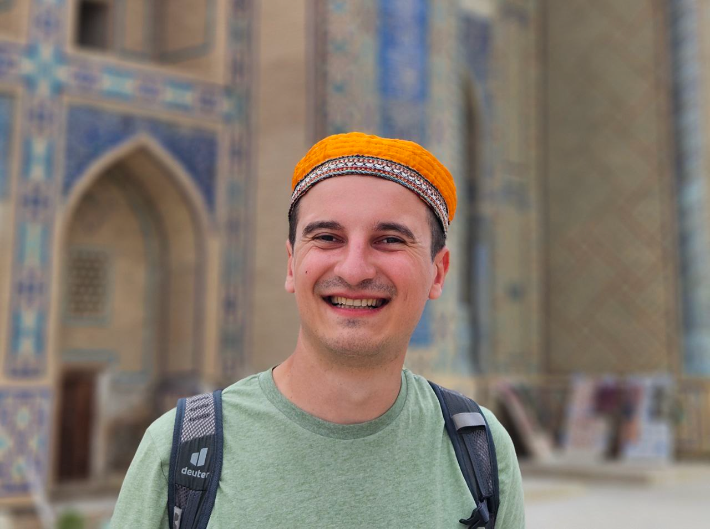{: style="width:300px"}

**QField и QFieldCloud - събиране на данни на терен**

> В работилницата ще се запознаем с процеса на създаване и настройка на проект за работа с QField и QFieldCloud за събиране на теренни данни, както и с особеностите на теренната работа. QField е мобилно приложение с отворен код, което помага за събиране на данни директно от центъра на събитията, при това с перфектна интеграция с QGIS.
>Работилницата ще бъде със сходно съдържание като предходни конференции.

---

Иван Иванов е [разработчик на ГИС софтуер с отворен код като QGIS, QField и QFieldCloud](https://github.com/suricactus/), [член на световната OSGeo организация](https://www.osgeo.org/member/ivanov/) и основател на онлайн платформата QGIS.bg, чиято цел е популяризиране на FOSS4G сред българските потребители.

| Допълнителна информация                        |                                                            |
|------------------------------------------------|------------------------------------------------------------|
| Продължителност                                | 3 часа                                                     |
| Необходими допълнителни материали              | Компютър с възможност за инсталиране на софтуер            |
| Очаквани ГИС познания                          | Минимални                                                       |
| Препоръчителни минимални знания на участниците | Участниците трябва да могат самостоятелно да работят с ГИС и да могат да следват упътванията на водещия работилницата.                                    |
| За каква аудитория е подходяща работилницата?  | Ученици, Студенти, Специалисти, работещи в сферата, Програмисти, Ентусиасти            |

#### Теодора Колева [:material-linkedin:](https://www.linkedin.com/in/teodora-koleva-4939aa2b4/)

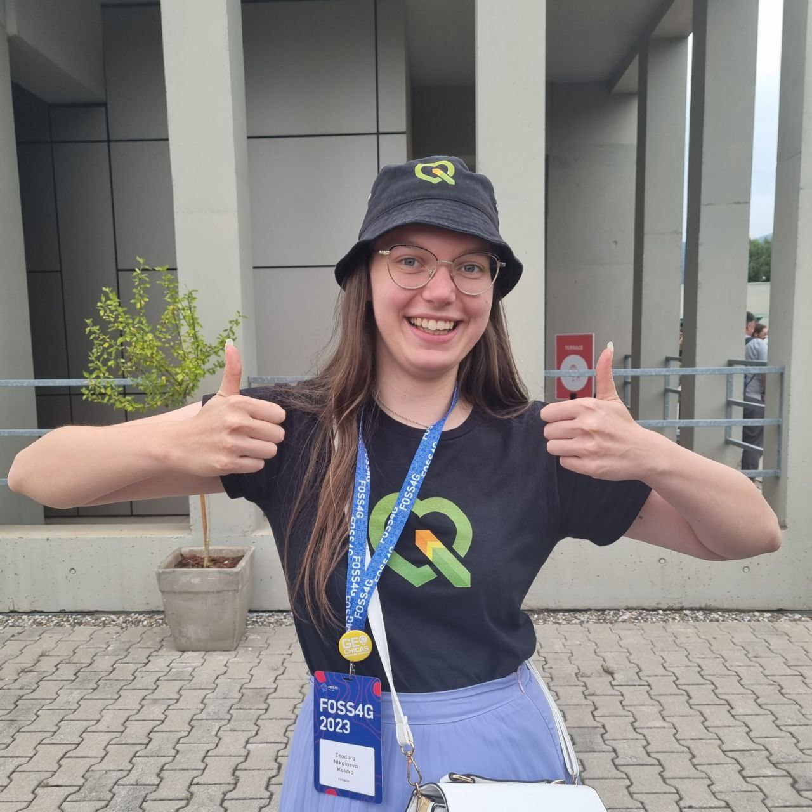{: style="width:300px"}

**Въведение в ГИС**

> По време на работилницата участниците ще придобият теоретични познания и основни умения за работа с QGIS. Ще се фокусираме върху особностите при използването на QGIS като потребителски интерфейс, работа със слоеве и симвология.

---

Теодора Колева е бакалавър по геопространствени системи и технологии. ГИС специалист на свободна практика, доброволец в QGIS.bg и [член на световната OSGeo организация](https://www.osgeo.org/member/koleva/).

| Допълнителна информация                        |                                                                |
|------------------------------------------------|----------------------------------------------------------------|
| Продължителност                                | 3 часа                                                         |
| Необходими допълнителни материали              | Компютър с възможност за инсталиране на софтуер                |
| Очаквани ГИС познания                          | Няма                                                           |
| Препоръчителни минимални знания на участниците | Няма                                           |
| За каква аудитория е подходяща работилницата?  | Ученици, Студенти, Ентусиасти |

#### инж. Яна Липийска

**Свободно достъпни данни  - решаване на практически задачи**

> Ще решим една от най- разпреостранените задачи в ГИС - пространствен анализ по няколко критерия (Multi-Criteria Decision Analysis - MCDA). Ще се възползваме от различни източници на свободно достъпни данни и различни типове данни (вектоени растерни, текстови). Ще направим най-"скучната" тежка и подценявана работа (без която не може, ако искаме да сме професионалисти), като си подберем, изчистим и нормализираме данните. Ще влезем в ролята на инвеститори и ще направим страхотна карта за финал.

---

Главен асистент към катедра "Фотограметрия и Картография", Геодезически факултет на УАСГ. Участник 3-та година в конференцията.

| Допълнителна информация                        |                                                                |
|------------------------------------------------|----------------------------------------------------------------|
| Продължителност                                | 4 часа                                                         |
| Необходими допълнителни материали              | Хартия и пособия за писане, Компютър с възможност за инсталиране на софтуер                |
| Очаквани ГИС познания                          | Минимални                                                           |
| Препоръчителни минимални знания на участниците | Няма                                      |
| За каква аудитория е подходяща работилницата?  | Ученици, Студенти, Специалисти, работещи в сферата, Ентусиасти |

## Конференция, 6 март, петък

В тази секция ще откриеш лекторите на конференцията, подредени по азбучен ред, както и връзки към техните профили в интернет пространството. На следващия ред е заглавието на лекцията, а в сиво е абстрактът.

### Габриела Горанова-Банович

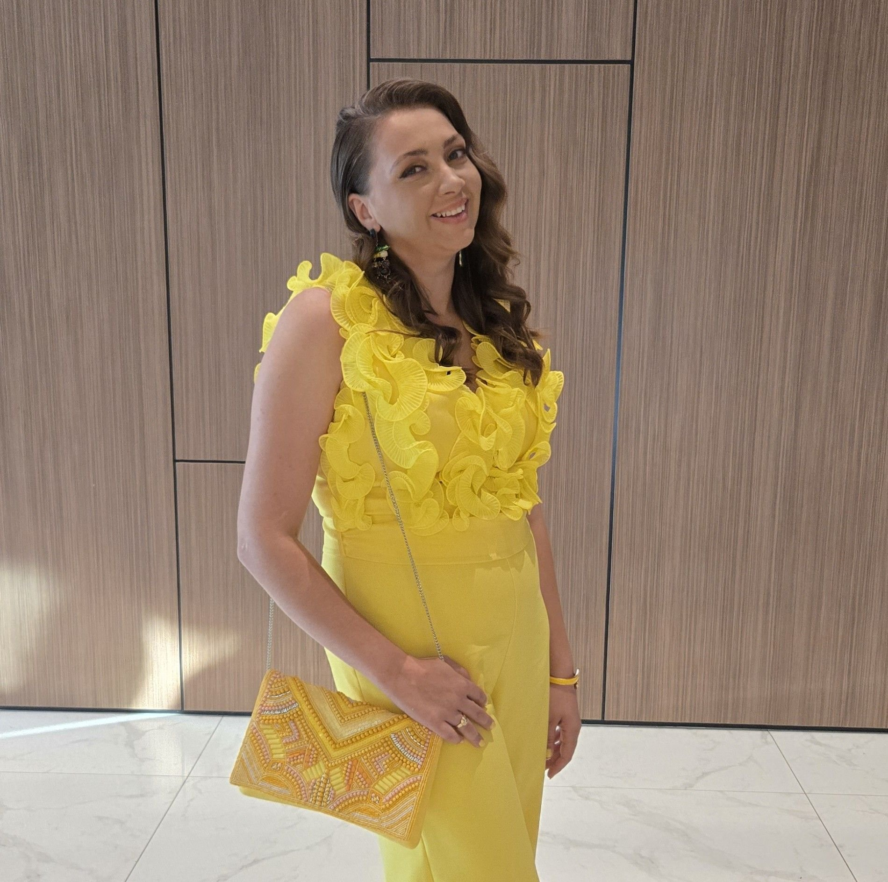{: style="width:300px"}

**Емоциите като данни: липсващият слой в ГИС. Може ли картографирането на човешките преживявания да доведе до по-добри градове?**

> "В ГИС и работата с отворени данни традиционно разчитаме на обективни, измерими показатели, докато човешките преживявания често остават извън анализа като нещо субективно и трудно използваемо. Въпреки това именно преживяването на пространството – усещането за сигурност, комфорт или напрежение – често е причината хората да отхвърлят иначе „логични“ и добре аргументирани проекти. Това поставя ключовия въпрос: ако можем да картографираме как хората се чувстват в пространството, можем ли да започнем да проектираме градове, в които те реално се чувстват добре?
> Презентацията ще разгледа как субективно събрани данни, като човешките емоции, могат да бъдат структурирани и използвани по професионален начин в ГИС среда. Тя стъпва върху реален казус от изложбата “Wien von Oben – Karte der Gefühle” - Виена отгоре - Карта на емоциите на Wien Museum през 2017 г., където посетителите отбелязват върху празна карта на Виена места, свързани с конкретни емоции. Данните, първоначално събрани върху аналогова карта, са дигитализирани и анализирани в ГИС в рамките на бакалавърска работа.
> Чрез сравнение на две гари във Виена - Praterstern и Westbahnhof презентацията ще покаже как функционално сходни пространства могат да бъдат преживявани по коренно различен начин и как детайли като настилка, осветление и пространствена организация оказват силно емоционално въздействие. Представен ще бъде и по-широкият контекст на отворените данни, мобилните технологии и изкуствения интелект, които днес създават възможност за постоянно събиране и анализ на подобна информация.
> Целта на лекцията е да насърчи студентите, преподавателите и практиците в ГИС да разглеждат емоциите не като „шум“, а като липсващ слой от данни, който може да допринесе за по-информирани решения и по-добре преживявани градски пространства."

---

"Габриела Горанова-Банович е експерт по ""Планиране и устройство на територията"", завършила в Техническия университет във Виена, Австрия. Професионалните ѝ интереси са насочени към пресечната точка между ГИС, градско планиране и човешкото преживяване на пространството с фокус върху процеси на включване на гражданското общество в планирането и създаване на нови пространствени данни.

В професионалния си път е работила по различни теми с използване на ГИС както в Австрия, така и в България, включително по локални ГИС проекти, свързани с наводнения, градски топлинни острови, по проекти за трасиране и проектиране на широколентови интернет мрежи и други. В момента дейността ѝ е фокусирана основно върху транспортно планиране и организация на движението, като работи с множество общини в цяла България. Независимо от конкретната тема, водеща нишка в работата ѝ остава стремежът към включване на гражданите в планирането и използване на ГИС като инструмент за съвместно, по-разбираемо и ориентирано към хората вземане на решения."

### Димитър Коритаров

**Миграция на данни - Inspire**

> *Предстои...*

---

Има над 26 години опит в сферата на ГИС системите. инж. геодезист с опит както в държавния, така и частния сектор. Участие в десетки големи ГИС проекти свързани с ключови министерства, агенции и държавни компании.

### Димитър Тасев

**И кофите заслужават карта**

>По време на кризата с отпадъците в София в 2025 г. стана ясно, че липсва актуална и структурирана карта на контейнерите в града. Презентацията показва как чрез теренно картографиране с Every Door и работа с OpenStreetMap, допълнени с custom плъгин и автоматизации, могат да се създадат консистентни, анализируеми и публично достъпни данни за градската инфраструктура.

---

Димитър Тасев е ентусиаст в областта на географските информационни системи и отворените данни с няколкогодишен активен опит в OpenStreetMap. Като студент във Факултета по математика и информатика – СУ той обича да превръща ежедневни градски проблеми в практически проекти, базирани на свободен софтуер, структурирани данни и малко инженерна упоритост — дори когато става дума за кофи за боклук.

### доц. Евгения Сарафова

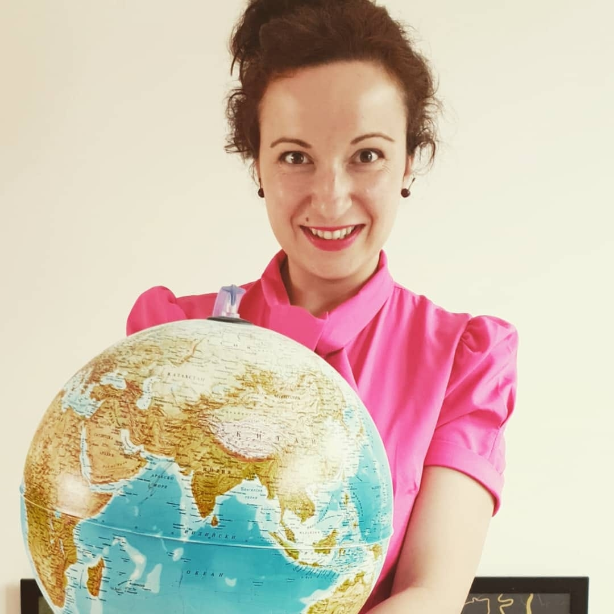{: style="width:300px"}

**Създаване на първата уеб карта на читалищата в България**

> Презентацията ще покаже на участниците стъпките, които бяха предприети, за да се стигне до успешното финализиране на първата карта на читалищата в България. Процесът на събиране и обработка на данни включи активна работа с QGIS, а самите пространствени данни и тяхната визуализация бяха създадени изцяло в тази софтуерна среда.

---

Любител на карти от детска възраст.

### Жоро Пенчев

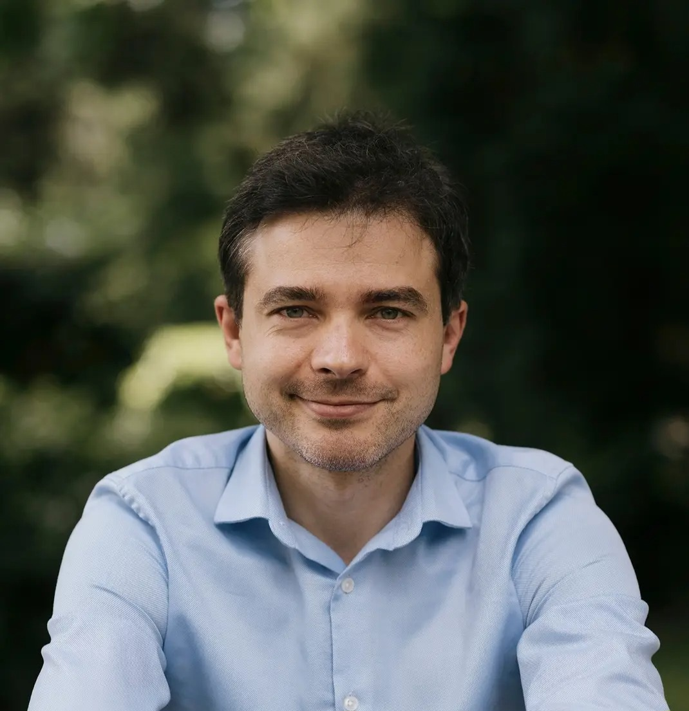{: style="width:300px"}

**Триизмерен активизъм**

> Техноактивизмът все повече започна да разчита на пространствени данни във второто десетилетие на века. Какви линейни комбинации обаче ни станаха достъпни в третото?

---

Жоро Пенчев е експерт по данни и електронно управление, преподавател, дългогодишен граждански активист с фокус върху технологии и общество. Координатор експертни политики и технологично развитие в Екипът на София.

### Ивайло Карабойков

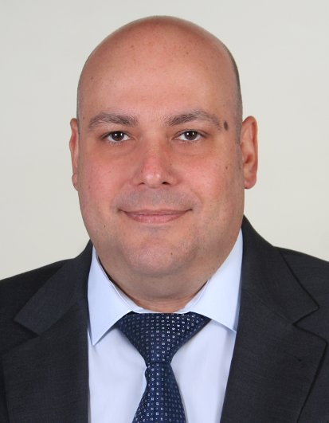{: style="width:300px"}

**Как да публикуваме QGIS проект във WEB с Lizmap?**

> Кратко представяне на Lizmap Web Client, връзката му с QGIS Desktop и QGIS Server, начинът на работа и очаквания резултат.

---

IT с повече от 30 години опит в областта - консултации, системна и мрежова администрация, хардуер, DevOps... Заклет привърженик на решенията, базирани на технологии с отворен код. Дългогодишен потребител и страстен почитател на FreeBSD. Ненавижда технологии, които застрашават и/или нарушават свободата на словото и личната неприкосновеност. В ефира може да се срещне като LZ6IK.

### Иван Иванов

{: style="width:300px"}

**QGIS отвъд ежедневната употреба**

> Демонстрация на някои не толкова известни функционалности и възможности, които могат да разрешат сложни географски проблеми с минимални усилия. Ще разгледаме как да пишем и използваме QGIS изрази, инструменти от кутията с инструменти, да направим анимации и други.

---

Иван Иванов е разработчик на ГИС софтуер с отворен код като QGIS, QField и QFieldCloud, член на световната OSGeo организация и основател на онлайн платформата QGIS.bg, чиято цел е популяризиране на FOSS4G сред българските потребители.

### Кристиан Петров

**Оценка на соларния потенциал на територията на Република България**

> Справянето ни с климатичните промени в световен мащаб изисква усилия с цел задоволяване на енергийните потребности на икономиките, без да се увеличава човешкото влияние върху климата. Иновативно решение представляват фотоволтаичните системи, бележещи успех в последните десетилетия и наложили се като водещ алтернативен енергоизточник. Соларните инсталации обаче са обективно ограничени от ниското си КПД, от слънчевата осветеност, от територията.
>
> Осъзнавайки тези проблеми, екипът по настоящото изследване си поставя за цел да предложи обоснована методика при вземането на решение за изграждане на соларен парк. В работата си авторите се ползват от възможностите на отворените данни и софтуери с отворен код, като методите, които прилагат, са експеримент, количествен и качествен статистически анализ с цел подкрепа на поставените твърдения.

---

Кристиан Петров е студент в първи курс в специалност "Геопространствени системи и технологии" на Геолого-географския факултет и QGIS ентусиаст. В годините назад е отличаван в картографските конкурси на Географ.БГ в рамките на Българския географски фестивал. През 2025-та година е бронзов медалист на Международната олимпиада по география в Тайланд.

### Любомир Радков

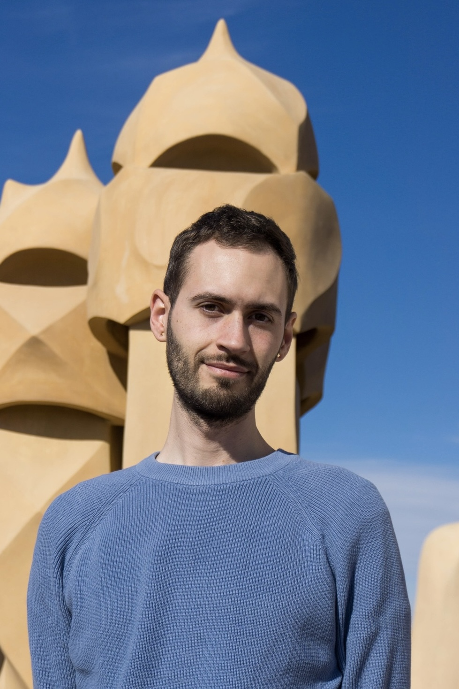{: style="width:300px"}

**Защо метаданните са необходими в ГИС?**

> Презентацията ще отговори на въпроса защо ни трябват метаданни в ГИС, каква е тяхната роля и как се използват правилно при работа с пространствени данни.

Любомир Радков е архитект по образование, но софтуерен разработчик по професия. От 2021 година разработва ГИС решения.

### Любомир Филипов

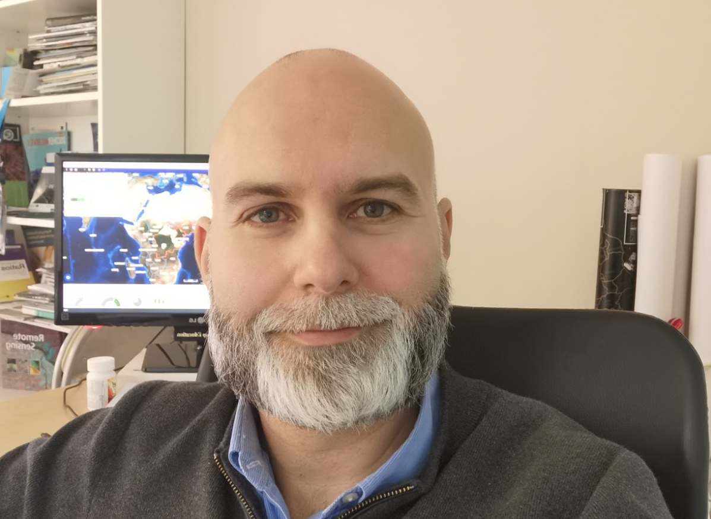{: style="width:300px"}

**GeoAI в действие: валидация на инвестиционни обекти на глобално ниво чрез данни от машинно обучение, сателитни изображения с много висока разделителна способност и фундаментални AI модели**

> Интересна част от актуален проект, в който се използва широк набор от решения с отворен код: QGIS, MerginMaps, QFIELD, KoboToolbox, Django, Postgres/PostGIS, DuckDB, Geoserver, OpenLayers, ML данни от Overture foundation, Airbus изображения и фундаментални модели като SAM3 и DINOv3.

---

ГИС експерт, с участие в редица проекти на Европейско и глобално ниво. Водил редица курсове в България по QGIS, Geonode, Postgre, GeoServer. HotOSM contributor, ръководил създаването на първите отворени ГИС данни в България (по JICA).

### инж. Николай Стойков

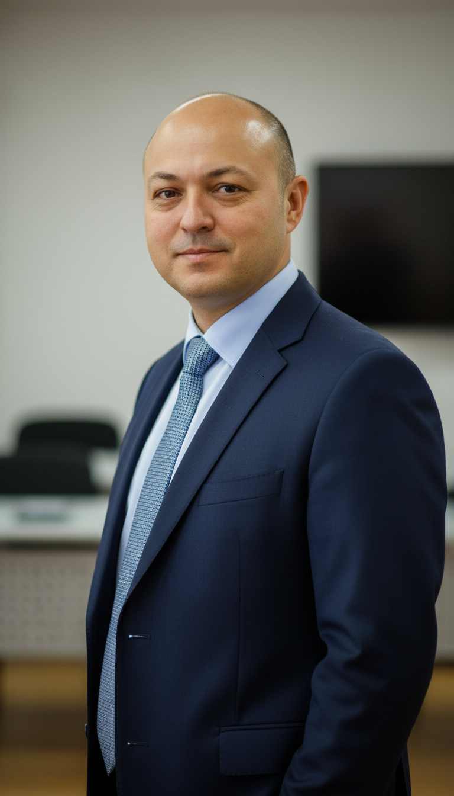{: style="width:300px"}

**Интелигентни карти: Практическо приложение на AI асистенти в QGIS чрез естествен език**

> Презентацията ще демонстрира как съвременните големи езикови модели (LLM) могат директно да взаимодействат с географски информационни системи. В рамките на 10-минутното представяне ще бъде разгледана интеграцията на AI асистента Claude в среда на QGIS.

---

15 години опит с Географски информационни системи в общинска администрация. Разработвал и реализирал значителен брой проекти чрез пространствени и дрон технологии.

### Петко Борджуков

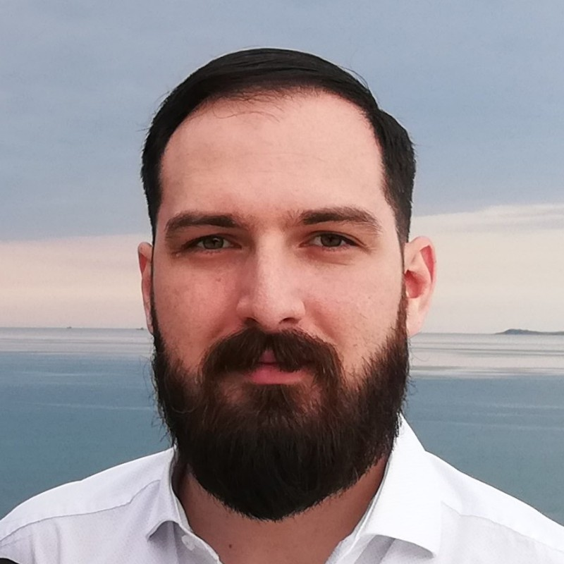{: style="width:300px"}

**Какво ново в OpenStreetMap?**

> "През 2025-а в OpenStreetMap за България се случиха няколко интересни развития. Най-важното сред тях беше въвеждането на нова предпочитана основа – изображение на земната повърхност.
> В това представяне ще поговорим за горното и други нововъведения – какви са последствията от тях, как да се възползваме от тях, както и техническата и административната работа, която беше нужна, за да се случат."

---

Програмист и дългогодишен редактор в OpenStreetMap.

### Теодора Колева

{: style="width:300px"}

**Градска морфология с OSMnx**

> Настоящото представяне цели да анализира ориентацията на улиците в шест български града чрез Python пакета OSMnx. Като един от главните аспекти на градската морфология, ориентацията на улиците дава сведения за развитието и формата на градската среда.

---

Теодора Колева е бакалавър по геопространствени системи и технологии. ГИС специалист на свободна практика, доброволец в QGIS.bg и член на световната OSGeo организация.

### Яна Даскалова

**Оценка на уязвимостта и устойчивостта на крайбрежни и градски райони към опасности, свързани с изменението на климата**

> "Проектът  BSB00479 – MoreAdaptBSB разработва ГИС-базиран модел за оценка на екологичната уязвимост чрез интеграция на климатични, екологични и социално-икономически пространствени данни от европейски и национални източници. Използвани са хармонизирани геопространствени бази данни, включително сателитни продукти (напр. Copernicus), климатични набори с исторически и бъдещи сценарии (TerraClimate, WorldClim), данни за природни опасности (наводнения, пожари, крайбрежна ерозия), земно покритие, растителни индекси, защитени територии, както и статистически данни за население и икономическа активност.
> Моделът е приложен за България, Румъния, Гърция и Украйна и включва сценарийно моделиране за два емисионни сценария (SSP1–2.6 и SSP5–8.5) и два времеви хоризонта (2050 и 2100 г.). Разработеният индекс представлява приложим инструмент за подпомагане на регионалното планиране, адаптационните политики и стратегическото управление на риска в условията на изменящ се климат."

---

Яна Даскалова е еколог и представител на П-Юнайтед ЕООД. Придобила е образователно-квалификационна степен „магистър“ по специалност „Възстановяване на околната среда и екологичен мониторинг“ в Лесотехнически университет. Работата ѝ е насочена към прилагане на научнообосновани подходи при анализ и управление на екологични процеси и територии, включително чрез използване на ГИС технологии и сателитни данни.

## Как да водя работилница?

Ако желаеш да водиш работилница на 5 март, четвъртък, попълни формуляра за участие не по-късно от 22 февруари 24:00.

[Заяви водене на работилница](https://docs.google.com/forms/d/e/1FAIpQLSdVxzN9LScHCxDCUs9H_6rBvg8uzUG3m3lKkzIn5Nbj6MczmQ/viewform?usp=header){ .md-button .md-button--primary }

Залите, в които ще се проведат работилниците, ще разполагат с мултимедия, екран, интернет връзка и разклонители, но останалите пособия трябва да се осигурят от заявилия водене на работилница и участниците, като компютри, инсталация на софтуер, включително компютър за водещия.

Може да се заявят повече от една работилници от един и същи лектор.

Организаторите си запазват правото да откажат регистрираната работилница, за което заявилият ще бъде надлежно уведомен.

## Как да стана лектор на конференцията?

Ако желаеш да водиш представяне на 6 март, петък, попълни формуляра за участие не по-късно от 22 февруари 24:00.

[Заяви водене на представяне](https://docs.google.com/forms/d/e/1FAIpQLScSLwWmDak8GaksoRH2xZ1MxDjv6T7ASzGcklF0QjWXxEJxTQ/viewform?usp=header){ .md-button .md-button--primary }

Залата, в която ще се водят представянията, ще разполага с мултимедия, екран, интернет връзка и компютър, на който предварително ще са качени представянията.

Заявилият лектор на конференцията трябва да предостави на 4 март `.pdf` с представянето на имейл foss4g@qgis.bg. Получаването на представяния в деня на конференцията няма да се приема, както и участието на лектор с импровизация по време на представянето.

Организаторите си запазват правото да откажат регистрираното представяне, за което заявилият ще бъде надлежно уведомен.

## Откъде да взема рекламни материали за събитието?

Рекламни материали за събитието можеш да вземеш от тук:

### Видео покана

- [2026_foss4g_video_invite.mp4](./img/2026_foss4g_video_invite.mp4)
- [2026_foss4g_video_invite.webm](./img/2026_foss4g_video_invite.webm)
- [YouTube връзка](https://www.youtube.com/embed/HZ_j3H8JR5g?si=CXziZjjkImzQZahg)

### Плакат на събитието

<!-- QR code generated with https://www.qrcode-monkey.com -->
- [2026_foss4gbg_osm_v1.png](./docs/2026_foss4gbg_osm_v1.png)
- [2026_foss4gbg_osm_v1.pdf](./docs/2026_foss4gbg_osm_v1.pdf)
- [2026_foss4gbg_osm_v1.svg](./docs/2026_foss4gbg_osm_v1.svg) - Inkscape

### Програма на работилници

- [2026_foss4gbg_programme_05_v1.png](./docs/2026_foss4gbg_programme_05_v1.png)
- [2026_foss4gbg_programme_05_v1.pdf](./docs/2026_foss4gbg_programme_05_v1.pdf)
- [2026_foss4gbg_programme_05_v1.svg](./docs/2026_foss4gbg_programme_05_v1.svg) - Inkscape

### Програма на конференцията

Предстои!
<!-- - [2026_foss4gbg_programme_08_v4.png](./docs/2026_foss4gbg_programme_08_v4.png) -->
<!-- - [2026_foss4gbg_programme_08_v4.pdf](./docs/2026_foss4gbg_programme_08_v4.pdf) -->
<!-- - [2026_foss4gbg_programme_08_v4.svg](./docs/2026_foss4gbg_programme_08_v4.svg) - Inkscape -->

## Ще публикувате ли материалите някъде?

Да, ще ги публикуваме тук.
Всички материали на лекторите ще се разпространят безплатно след края на събитието.

## Как да помогна?

Пиши на foss4g@qgis.bg или се включи в [Телеграм канала](https://t.me/joinchat/Zxo__KwkcG5mMDU8) на QGIS.bg и предложи помощта си.

## Какво са "светкавичките" ⚡️?

Светкавичките са формат на кратко представяне на идея, технология или проект, която се вмества в 5 минути. "Светкавичка" е опит за превод на "lightning talk", понякога се превежда и като "блицдоклад".

Всеки може да заяви светкавичка по време на конференцията на 6 март, петък.
Свържете се с организаторите на конференцията преди или по време на събитието.
