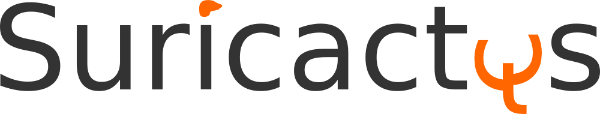

# Добре дошли

## Увод в ГИС

Ръководството е за всеки, който се вълнува от карти и география и желае да научи повече за основните понятия и принципи. Подходящо е като въведение за напълно начинаещи в сферата на географските информационни системи (ГИС) и цифровизацията на географската наука.

Без усърдната работа на Тим Сътън, както и последвалите автори и редактори, този текст нямаше да е реалност. Преводът, осъвременяването и адаптацията му на български е на Иван Иванов - suricactus.

Този текст нямаше да съществува и без QGIS - безплатно и отворено ГИС приложение за всеки, за всяка операционна система.

## Авторство

#### Оригинални автори

Т. Сътън (Т. Sutton), О. Дасау (O. Dassau), М. Сътън (M. Sutton)

#### Оригинален спонсор

Chief Directorate: Spatial Planning & Information,
Department of Land Affairs, Източен Кейп, Южна Африка.

#### Оригинално партньорство

Spatial Information Management Unit, Office of the Premier, Източен Кейп, Южна Африка.

#### Превод на български

- Иван Иванов - suricactus
- Евгения Сарафова

| | | |
|-|-|-|
|  |  |  |

#### Авторско право
(c) 2009 Chief Directorate: Spatial Planning & Information, Department of Land Affairs, Eastern Cape.

(c) 2021 Иван Иванов - suricactus

Дава се разрешение за копирането, разпространението и модификацията на този документ под лицензионните условия на лиценза за свободна документация на ГНУ, версия 1.2 или по-нова. Не са включени непроменливите раздели, текстове на предна и задна корица. Превод и оригиналния текст на лиценза са влючени в секцията [13. Лиценз](/gisintro/99_licence).

## Думи на преводача

Разбирането на обикалящата ни среда безспорно може да предотврати и обясни огромно количество информация за света около нас - предвиждане на наводнения и засушавания, струтвания по пътищата, проверка на реколтата, следене на природни и социални процеси, откриване на най-краткия път и още и още безкрайни приложения.

Свободния софтуер, свободните данни и свободното знание са засилващи се тенденции по целия свят, макар и у нас това да е с известно закъснение.

Дълги години свободните материали за ГИС на български бяха силно ограничени и непълни. С този превод се надявам да успеем да положим основите на една по-отворена географска общност в България, където с помощта на отворените технологии да успеем да изградим едно по-геоинформирано общество.

Въпреки че думите на оригиналния автор по-долу са написани преди 12 години в контекста на развиваща се африканска страна, те са не по-малко адеквактни и през третото десетилетие на века в страна членка на Европейския съюз. С популяризацията на QGIS и другите отворени продукти в страната се надявам, че монополното положение на определени организации и идеи за постоянно затваряне и криене на инструменти, умения и знания постепенно ще остане част от миналото и ще отворим нова страница на коопериране помежду географската общоност.

## Думи на оригиналния автор

Този проект беше спорнсориран от Главна дирекция "Пространствено планиране и данни", (Chief Directorate: Spatial Planning & Information), Министерство на поземлените въпроси (Department of Land Affairs), Източен Кейп, Южна Африка (бел. прев. към 2021 наследен от Главна дирекция "Национална геопространствена информация").

ГИС е все по-важен инструмент в редица сфери, като управление на природната среда, хотелиерство, военно дело, опазване на реда, туризъм и още много други сфери на ежедневието. Който е използвал компютър или телефон, най-вероятно е използвал ГИС без дори да го осъзнае. Може би е било карта в някой уебсайт, Google Earth, туристически киоск или мобилен телефон с навигация. Всичко в това ръководство, а и много повече, може да се постигне с платен софтуер със затворен код (който не може да бъде споделян или променян). Този софтуер обаче е скъпоплатен, а и ограничава свободата за копиране, споделяне и променяне. Понякога софтуерните корпорации правят изключения за образователни институции, като предоставят по-евтини или безплатни версии на техния софтуер. Това се прави, защото ако веднъж преподавателите и техните ученици се свикнат с платения софтурер, надали биха инвестирали време да разучат други софтуерни програми. Когато учениците напуснат образователната институция и започнат работа, те ще си купят комерсиален лиценз просто защото не са знаели, че има свободни и безплатни алтернативи.

С QGIS имаме алтернатива - софтуер, който е безплатен като цена и свободен в социалното му значение. Няма ограничение на броя копия, които можеш да направиш на този софтуер. Когато учениците напуснат училище, те могат да продължат да използват същия софтуер, за да развиват уменията си и да превръщат света в едно по-добро място.

Когато си купуваш комерсиален софтурер, ти ограничаваш собствените си бъдещи възможности. При изучаване, употреба и споделяне на свободен и отворен софтуер, ти развиваш уменията пестейки средства, които могат да бъдат по-разумно похарчени за развитието на икономиката.

Със спонсорирането на съставянето на това ръководство, Министерството на поземлените въпроси полага основите, на които да стъпят свежите идеи на младежта. Когато свободното споделяне на знания и умения са на почит, то вълнуващите резултати няма да закъснеят. Затова най-дълбоки благодарности към министерството!

Надяваме се разучаването и работата с QGIS ще те зарази в духа на Убунту!

Тим Сътън, април 2009
