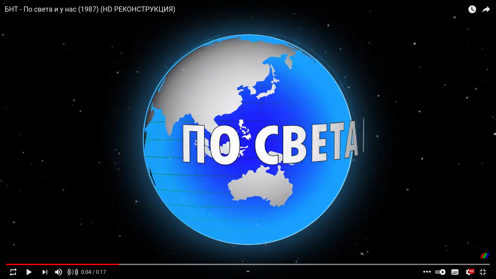

# По света и у нас

{! includes/map_oops.md !}

Източник: https://youtu.be/U5CC4uW85-I?t=4

??? info "Отговор"

    Със сигурност на много карти някои острови липсват, в повечето случаи заради прекалено дребния мащаб. И все пак, на тази карта липсва цяла държава призната от България, разположена на два острова с размерите на България, Сърбия, Македония, Косово и Албания взети заедно.

    За щастие в оригиналното видео, този проблем не е наличен: https://youtu.be/BbivlKfLMRo
