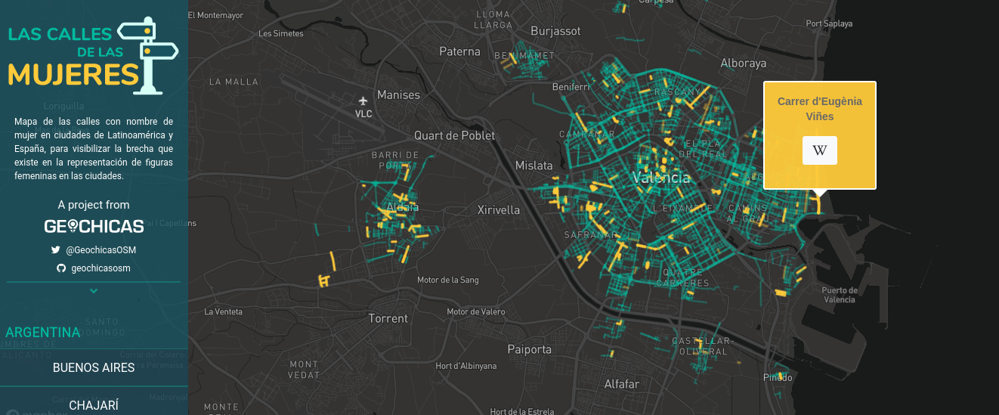

# GeoChicas

GeoChicas (джиочикас) е международна женска картографска общност с членове в повече от 12 различни държави. Целта им е жените да имат по-голямо присъствие и участие в ключови събития на [OpenStreetMap](./osm.md), да увеличат женското участие и лидерство и да работят по картографски проекти, които са от полза за жените. Основният им фокус като група е да помогне за преодоляване на различията между половете в общността на OSM по отношение на участието, създаването и съхраняването на данни.

В чест на Международния ден на жената през 2018 г. GeoChicas стартира проект "Las Calles de las mujeres" или "Пътищата на жените". Този проект се фокусира върху проучването на улици, които са кръстени на жени в Латинска Америка и Испания. Инициативата свързва и генерира съдържание за видни жени в OpenStreetMap и Уикипедия чрез проучване на имена на улици и свързването им с биографии. Този съвместен процес на разказване на истории чрез картографиране поставя акцент върху важността на споменаването на историческите жени, техните борби и постижения чрез публичното и цифровото пространство.

GeoChicas също така провеждат изследвания за участието на половете сред допринасящите за OpenStreetMap, за да се разберат по-добре различните гледни точки и преживявания, свързани с концепцията за пола в общността, и да се анализира ролята, представителството и участието на жените в нея. Целите на подобни проучвания са намирането на начини за осъзнаване на различията и преодоляване на пречките за разбирането и обединяването на силните страни между половете.

