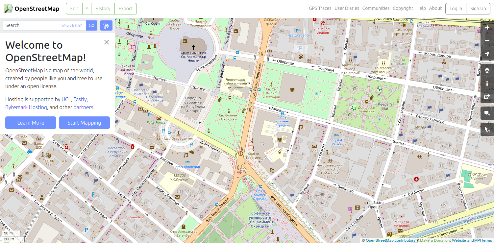
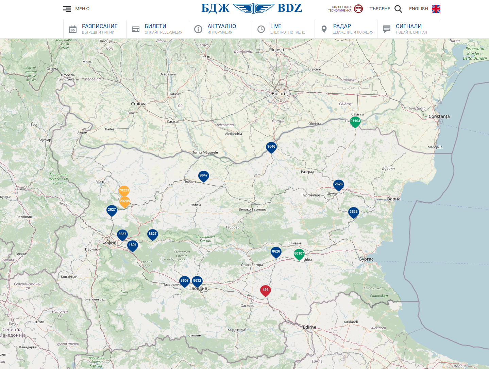

# OpenStreetMap (OSM)

OpenStreetMap или OSM (оупънстрийт мап или о-ес-ем) е съвместен проект, който има за цел да създаде безплатна, редактируема карта на света.
Той стартира през 2004 г. и оттогава се е превърнал в една от най-големите и всеобхватни платформи за картографиране в световен мащаб.
За разлика от затворените картографски услуги, OSM разчита на приноса на доброволци от цял свят, които използват GPS устройства, въздушни снимки и местни познания, за да добавят и актуализират картографски данни.
Този подход, основан на принципа "crowdsourcing", позволява създаването на много подробни карти, които могат да бъдат свободно достъпни и използвани от всеки.

Данните в OpenStreetMap се състоят от различни слоеве, включително пътища, сгради, забележителности, реки и други географски характеристики.
Участниците използват тагове, за да добавят атрибути като имена на улици, видове сгради и интересни точки, като по този начин гарантират, че картата е богата на информация.
Данните от OSM се съхраняват в структуриран формат, който е леснодостъпен за използване в широк спектър от приложения - от навигация и градско планиране до реакция при бедствия и мониторинг на околната среда.

Една от основните силни страни на OpenStreetMap е нейната отвореност и гъвкавост.
Данните са достъпни под отворен лиценз, което позволява на всеки да има достъп, да ги използва и да допринася за тях без ограничения.
Това доведе до широкото приемане на OSM от правителства, предприятия, организации с нестопанска цел и частни лица по целия свят.
Данните от OSM се използват в различни приложения, включително мобилни навигационни приложения, географски информационни системи (ГИС) и услуги, базирани на местоположението.
Освен това общността на OSM активно разработва и поддържа инструменти и софтуер, които подпомагат използването и манипулирането на данните от OSM, което допълнително повишава тяхната полезност и достъпност.

Около OpenStreetMap е изградена мрежа от ресурси, продукти и проекти.
Примери за такива проекти са WikiMedia, [Humanitarian OpenStreetMap Team](./hot.md), AndroidAnd и много други.
Много от комерсиалните доставчици на картографски продукти купуват данни от OpenStreetMap за техните нужди.

## Инструменти

- iD - редакторът на географски данни, който работи в браузъра при режим на редакция.
- JOSM - Java базиран графичен редактор за напреднали, който улеснява обработката на големи площи и групи обекти.
- OSMAnd - Android приложение за визуализация и редакция на OpenStreetMap данни в режим без интернет.
- QuickOSM - разширение за [QGIS](../technologies/qgis.md), което позволява лесното търсене и сваляне на OSM данни във векторен формат.

## Събития

От 2007 г. насам общността на OpenStreetMap провежда ежегодна международна конференция, наречена State of the Map (SotM), на която всички заинтересовани страни се събират, за да споделят напредъка си и да обсъждат проблеми.
Провеждат се и различни национални, регионални и континентални конференции на SotM, като SotM САЩ, SotM Балтика, SotM Азия и SotM Африка.

## Галерия

## Външни връзки

- Страница: https://osm.org
- Уики: https://wiki.openstreetmap.org
- GitHub: https://github.com/openstreetmap
