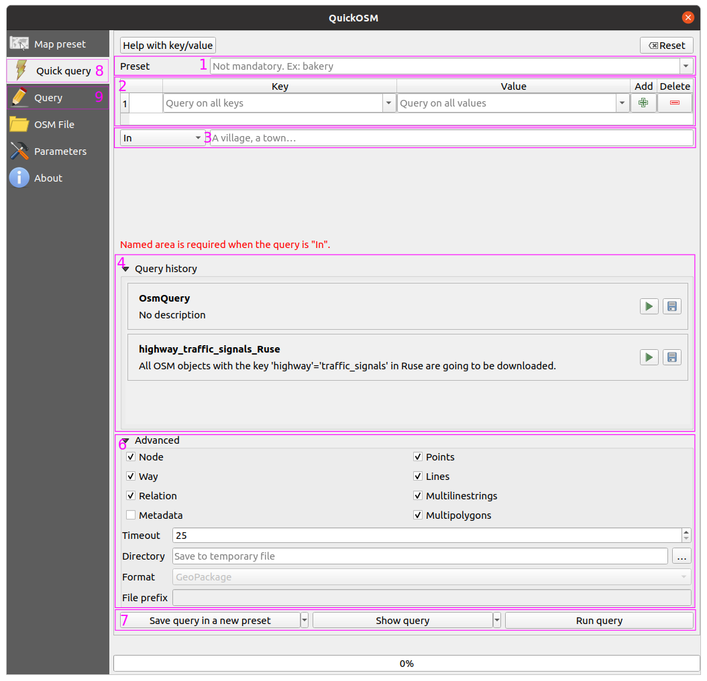

Един от най-големите източници на свободни данни е [OpenStreetMap](https://osm.org). QuickOSM (КуикОеСеМ) е плъгин за QGIS, който позволява лесното изтегляне на определено подмножество от данни.

## Стъпки

1. Инсталирайте QuickOSM плъгина в QGIS.
2. Натиснете на първата икона от лентата с инструменти на QuickOSM, за да отворите диалоговия прозорец QuickOSM диалоговия прозорец.
3. Въведете един или повече филтри за данните, които искате да изтеглите.
4. Изберете типовете данни, които трябва да бъдат потърсени.
5. Натиснете `Run Query`, за да изтеглите данните.
6. Готово!

## Описание на диалоговия прозорец `QuickOSM`

## Пример

Пример с за изтегляне на всички светофарни сигнали в Русе.

<video controls width="100%">
    <source src="https://qgis.bg/media/quick_osm.mp4" type="video/mp4">
    Sorry, your browser doesn't support embedded videos.
</video>
