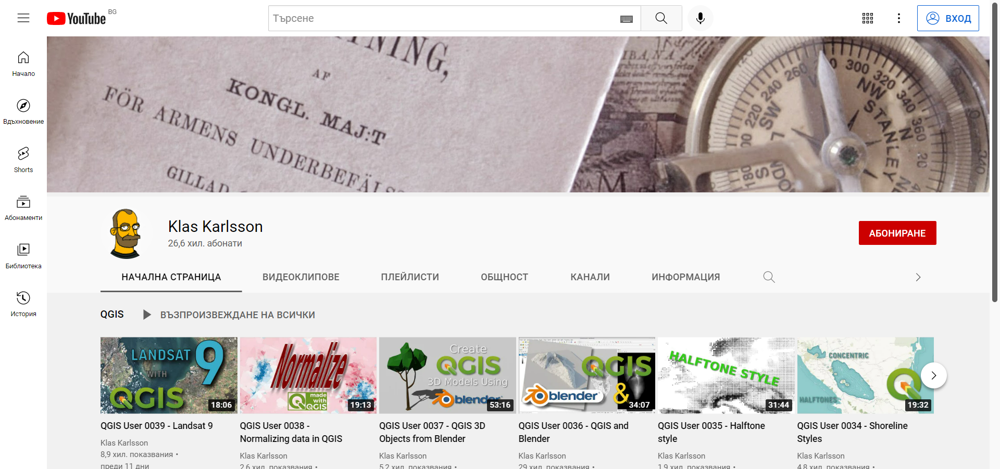
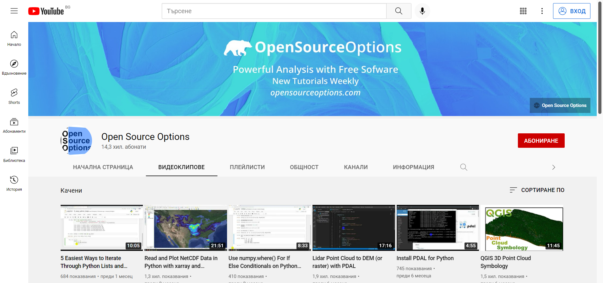
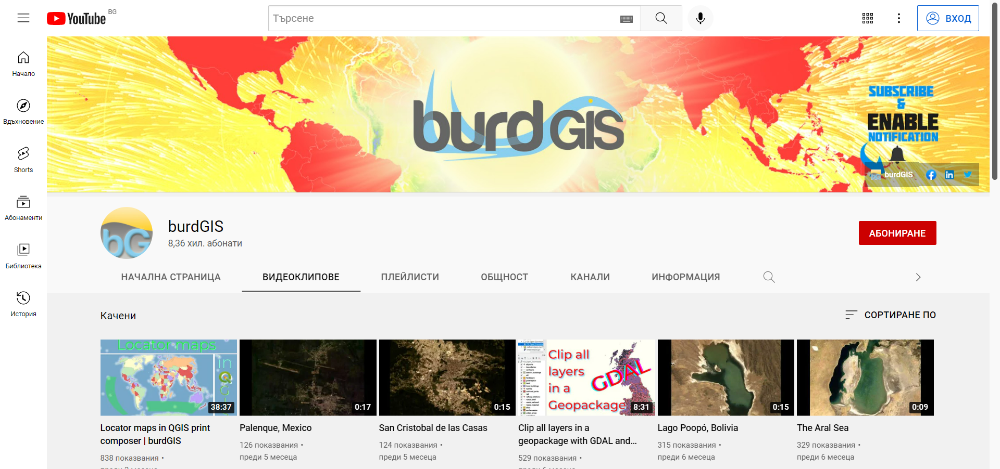
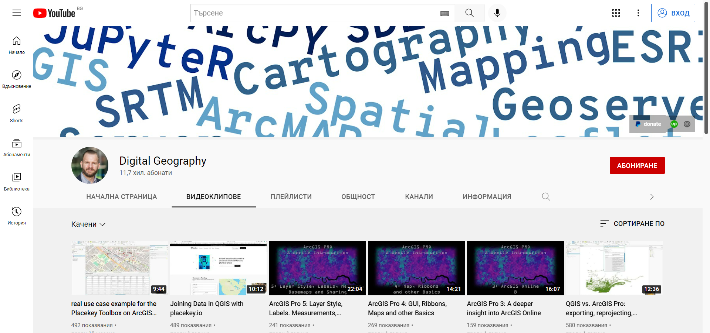

В този списък е събрана колекция от Ютуб (YouTube) канали, засягащи темата за работа с ГИС софтуери и други, съвместими с ГИС, софтуерни продукти. Съдържанието е подходящо както за начинаещи, така и за напреднали потребители, като обясненията във видеата са на английски език.

### [QGIS](https://www.youtube.com/channel/UCGS162t4hkOA0b35ucf1yng)

Официалният YouTube канал на QGIS. В него се качват записи от събития, свързани с QGIS и други приложения с отворен код. Най-гледаното събитие е QGIS Open Day, който се провежда в последния петък от всеки месец. Това и останалите събития в канала представят нови функционалности, функционалности за напреднали, приложение на QGIS в различни системи по света и друга техническа и организационна информация.

[YouTube](https://www.youtube.com/channel/UCGS162t4hkOA0b35ucf1yng){ .md-button }

### [Klas Karlsson](https://www.youtube.com/c/KlasKarlsson)

Видеата са на най-различни теми, като използваният ГИС софтуер е QGIS. Klas Karlsson показва начини за интеграция на QGIS с други софтуери, дава идеи за визуализация на данни и съвети за начинаещи потребители.

[YouTube](https://www.youtube.com/c/KlasKarlsson){ .md-button }

### [Hans van der Kwast](https://www.youtube.com/c/HansvanderKwast)

Съдържанието засяга главно хидроголията и създаването на хидроложки анализи в QGIS. Видеата са добре обработени, а обясненията разбираеми, като се започва от представянето на основни концепции в ГИС до тяхното реално прилагане. Засяга се използването на софтуер с интерфейс с команден ред (CLI) като SAGA, PCRaster, GDAL и други. Добър източник на информация за ГИС моделиране и автоматизиране на процеси в QGIS с QGIS Model Designer.

[YouTube](https://www.youtube.com/c/HansvanderKwast){ .md-button }

### [Open Source Options](https://www.youtube.com/channel/UCOSeGDrlScCNgBcN5C8nTEw)

Използват се софтуери с отворен код за ГИС и статистика. Фокусът е върху QGIS, QGIS Python (PyQGIS) скриптове и плъгини и анализ на данни.

[YouTube](https://www.youtube.com/channel/UCOSeGDrlScCNgBcN5C8nTEw){ .md-button }

### [Luca Congedo](https://www.youtube.com/c/LucaCongedoGIS)

Каналът се съсредоточава върху класификация на земното покритие и дистанционни изследвания. Luca Congedo е автор на Semi-Automatic Classification плъгин за QGIS.

[YouTube](https://www.youtube.com/c/LucaCongedoGIS){ .md-button }

### [burdGIS](https://www.youtube.com/c/burdGIS)

Съвети и трикове за работа с ГИС, изработване на уебкарти, като се използват различни софтуерни продукти.

[YouTube](https://www.youtube.com/c/burdGIS){ .md-button }

### [Digital Geography](https://www.youtube.com/c/RiccardoKlinger)

Застъпва разнообразни теми за ГИС и геостатистика, представени под формата на уроци, които могат да бъдат полезни както за начинаещи, така и за средно ниво потребители.

[YouTube](https://www.youtube.com/c/RiccardoKlinger){ .md-button }

### [Hatari Labs](https://www.youtube.com/c/HatariLabs)

Каналът е посветен на хидроложко моделиране и изработване на пространствени анализи с QGIS и Python. Подходящ за по-напреднали потребители.

[YouTube](https://www.youtube.com/c/HatariLabs){ .md-button }

### [Qiusheng Wu](https://www.youtube.com/c/QiushengWu)

Канал за ГИС, дистанционни изследвания, моделиране на околната среда, визуализация. Богато съдържание, работи се с различни ГИС софтуери. Видеата представят по-сложни операции, затова и са насочени към напреднали потребители.

[YouTube](https://www.youtube.com/c/QiushengWu){ .md-button }

