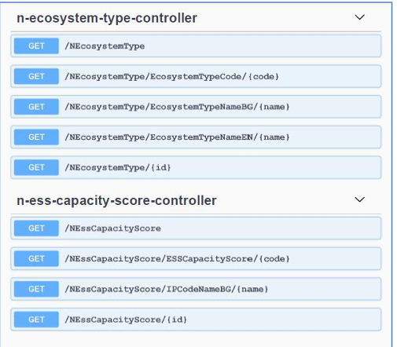

# GeoServer

GeoServer е софтуерен ГИС сървър с отворен код, написан на Java, който позволява на потребителите да споделят и редактират геопространствени данни. Проектиран за оперативна съвместимост, съгласно, GeoServer публикува данни от всеки основен източник на пространствени данни, използвайки отворени стандарти.

GeoServer е референтното внедряване на стандартите на Open Geospatial Consortium (OGC) за Web Feature Service (WFS) и Web Coverage Service (WCS), както съвместима услуга за уеб карти (WMS), съвместима каталожна услуга за уеб (CSW) и внедряване на услуга за уеб обработка (WPS).

GeoServer е поддържан от голям брой организации и разработчици и е широко използван в огромен брой проекти по света. 

GeoServer естествено се интегрира лесно с клиентските библиотеки [OpenLayers](./openlayers.md) и [Leaflet](./leafletjs.md), както и възможност за връзка към пространствени системи за управление на бази от данни като [PostgreSQL/PostGIS](./postgresql.md) и десктоп ГИС софтуери като [QGIS](./qgis.md).

## Какво може GeoServer?

- Възможност за публикуване на ГИС данни от различни формата в Уеб под формата на стандартни (OGC) съвместими уеб картни услуги.
- Осигурява оперативна съвместимост, покривайки изискванията на OGC за WMS, WFS, WMTS, WCS, CSW и др.
- Възможност за свързване към СУБД, например PostgreSQL/PostGIS и други база данни и/или файлове.
- Управление на стилове и визуализация на ниво уеб услуги, тясно интегрирани с [QGIS](./qgis.md).
- Групиране на отделни услуги, възможност за кеширане на данни и различни пространствени операции.
- Възможност за преглед на публикувани данни, например чрез [OpenLayers](./openlayers.md) и експорт в различни формати.
- Възможност за справки, филтриране и уеб редакция на данни.
- Възможност за автоматична връзка към други портали и интегриране на данни на база уеб ГИС услуги. 
- Директна интеграция/връзка с настолни ГИС софтуери [QGIS](./qgis.md).

## Галерия

Повече информация за GeoServer може да намерите в [GeoServer официална страница](https://geoserver.org/).

Примерни приложения на GeoServer в България:

## Как да инсталирам?

Инсталацията на GeoServer много зависи от обема данни (растерни/векторни), настройките за кеширане на уеб услуги (GeoWebCache), броя публикувани уеб услуги и респективно броя потребители. Минималните изисквания са сървър (виртуален/клауд базиран или физически) са:

- 8GB RAM (силно препоръчително е 16GB за продуктова среда);
- 2.2GHz процесор с 4 ядра;
- 30GB дисково пространство (запазено за операционната система и самия портал, допълнително място спрямо изискванията на пространствените данни);
- Препоръчително е поне 100GB пространство и силно препоръчителна 64-битова среда, под Линукс (latest Ubuntu LTS).

За пълни инструкции за инсталация на Windows, Linux, като Docker контейнер вижте [официалното ръководство на GeoServer](https://docs.geoserver.org/main/en/user/installation/index.html).

## Външни връзки

- Основна страница на проекта: https://geoserver.org
- Официално хранилище: https://github.com/geoserver/geoserver 
- GeoServer документация: https://docs.geoserver.org/
