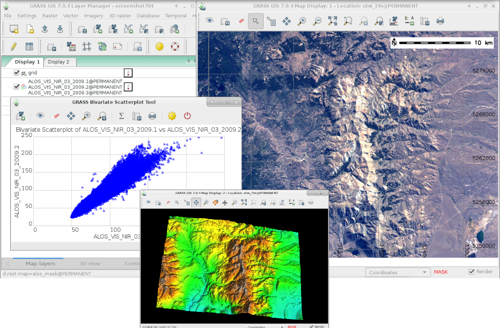
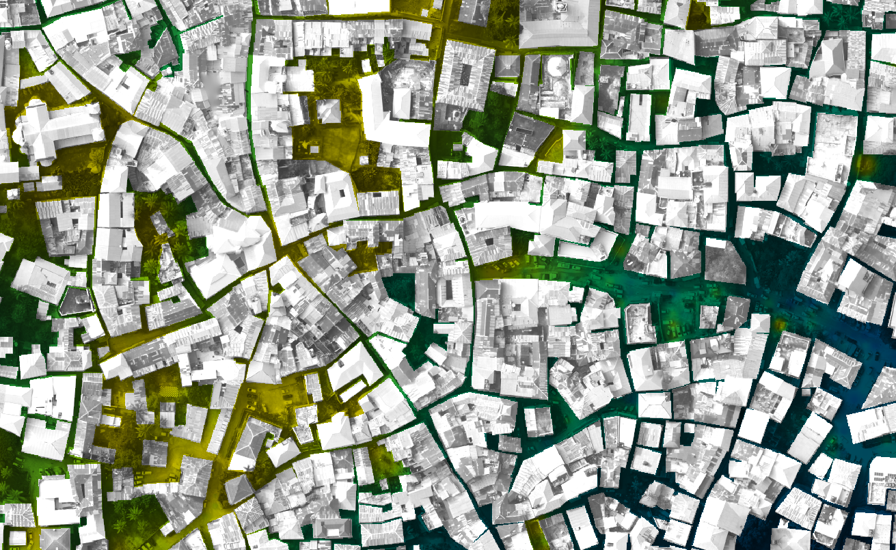
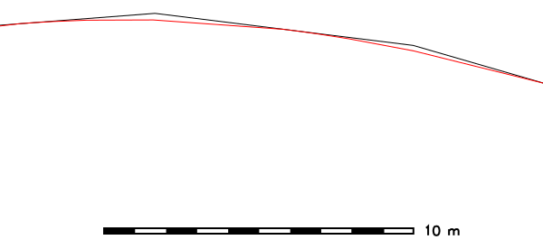
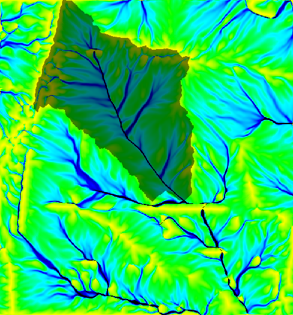

# GRASS GIS


GRASS GIS (грас гис) е ГИС технология, разработена за управление, обработка, пространствено моделиране и визуализация на различен тип данни.
Акроним на Geographic Resources Analysis Support System, което се превежда като система за поддръжка на анализа на географски ресурси.
Софтуера съдържа повече от 500 модула за обработване на векторни, растерни, вокселни и темпорални (времеви) данни.
Благодарение на системата си писане на потребителски разширения, има налични още стотици допълнителни потребителски функционалности.

Съществуват множество интерфейси към други програми - геостатистически услуги, бази данни, уеб карти или друг ГИС софтуер.
Може да служи както като настолен ГИС с модерен графичен потребителски интерфейс, или като софтуерна услуга достъпна през други програми.

GRASS GIS се използва в научни приложения, в бизнеса и от публични организации по целия свят.

Началото си GRASS GIS води още от 80-те години на миналия век, но активната му разработка продължава и до днес.
Силата и успеха на проекта се дължат на голямо общество от сътрудници, които обединяват усилия, за да правят GRASS GIS все по-лесен и удобен за ползване от всички.


## Галерия






## Функциналности

- **Многообразни файлови формати** - GRASS GIS поддържа почти всички файлови формати за геопространствени данни чрез употребата на [GDAL/OGR](./gdal.md).
- **Растерен анализ** - интерполация, маскиране, корелация, ковариация и др.
- **3D растер (или воксел) анализ** - 3D анализ и визуализация.
- **Обработка на изображения** - изображения от безпилотни летателни средства (БЛС) или сателити.
- **DTM анализ** - генериране на контури и повърхности, изчисляване на най-оптимален маршрут и анализ на наклон на склона, различни хидроложки инструменти.
- **Векторен анализ** - буфериране, маски, анализ на мрежи.
- **Времева (4D) рамка** - поддръжка за управление и анализ на времеви данни, големи пространствено-времеви данни за околната среда.
- **Анализ на облаци от точки** - LiDAR и др.;
- **Пространствени статистики** - корелационен и ковариационен анализ, регресия, зонални статистика.
- **SQL** - интерфейси на бази данни към PostgreSQL, SQLite и др.


## Примери

### Опростяване и заобляне на линия

```
v.generalize input=roads output=roads_chaiken method=chaiken threshold=1 error=roads_chaiken_leftover
```




### Създаване на водосборен басейн

```
r.watershed elev_lid792_1m threshold=5000 accumulation=accum_5K drainage=draindir_5K basin=basin_5K
```




## Особености

Имената на алгоритмите в GRASS GIS следват специфична категоризация и логика.
Тези, които започват с `v.` са за обработка на векторни слоеве, а тези, които започват с `r.` са за обработка на растерни слоеве.


## Интерфейси

GRASS GIS може да се използва през различни интерфейси.

- **Графичния потребителски интерфейс** - графичен интерфейс с множество различни инструменти.
- **Интерфейс от командния ред (CLI)** - изпълнение на алгоритми от командния ред.
- **уеб интерфейс** - изпълнение на алгоритми WPS.
- **C** - интеграция с външен софтуер.
- **QGIS** - изпълнение на алгоритми директно от QGIS.
- **Python** - библиотека с обектно-ориентирано API.
- **R** - статистически интерфейс към GRASS GIS, наречен **rgrass7**.


## Външни връзки

- Страница: https://grass.osgeo.org/
- Документация на версия 8.3: https://grass.osgeo.org/grass83/manuals/
