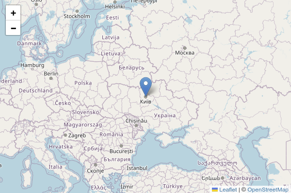

# Leaflet

Leaflet.js (лийфлет джей-ес) е малка и лека библиотека на JavaScript с отворен код, която се използва за създаване на интерактивни карти в уеб страници и оптимизирана за работа с мобилни устройства. Тя предоставя на разработчиците мощен набор от инструменти за създаване на адаптивни карти, които могат лесно да се интегрират в уеб среда. Leaflet.js поддържа различни източници на картографски данни - XYZ плочки, GeoJson, KML и др.

Leaflet е проектиран с оглед на простотата, производителност и удобство. Работи ефективно на всички основни настолни и мобилни платформи и има лесен за използване и добре документиран API интерфейс. API интерфейсът позволява добавяне на маркери, полигони, линии и други обекти към картите, както и построяване на графичен интерфейс за добавяне на бутони и контроли. Освен това Leaflet.js поддържа широк набор от приставки и разширения, които увеличават още повече функционалността му, позволявайки на разработчиците да добавят функции като геолокация, маршрутизация и пространствен анализ към своите карти с минимални усилия. Като цяло Leaflet.js е универсално и гъвкаво решение за създаване на карти, което дава възможност на разработчиците да създават динамични и интересни изживявания, базирани на карти в интернет.

