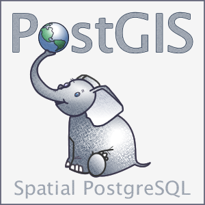
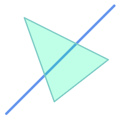

# PostGIS



PostGIS (постгис) e разширение на [PostgreSQL](./postgis.md), което добавя възможност за работа с географски обекти - съхранението, търсенето, обработката и анализа на пространствени данни.


## Какво може PostGIS?

- Съхранение на векторни и растерни данни в 2D и 3D.
- Пространствени индекси за бързо търсене.
- Пространствени функции за филтриране и анализиране на данните – измерване на дистанция, площи, пресичания, буфериране и т. н.
- Обработка на пространствени обекти – опростяване, преобразуване, генерализация и др.
- Геокодиране и обратно геокодиране.
- Интеграция с различни софтуери: QGIS, GeoServer, MapServer, ArcGIS, Tableau.
- Работа с всички координатни системи.


## Особености

Повечето функции в PostGIS започват с представката `ST_`, накратко за Spation-Temporal (пространствено-времеви).


## Примери

### Буфериране


=== "Заявка"
    ```sql
    SELECT ST_AsText(
        ST_Buffer(
            ST_GeomFromText('POINT(100 90)'),
            50,
            'quad_segs=8'
        )
    );
    ```
=== "Изход"
    ```
    POLYGON((150 90,149.0392640201615 80.2454838991936,146.19397662556435 70.86582838174553,141.57348061512727 62.221488349019914,135.3553390593274 54.64466094067266,127.77851165098015 48.42651938487277,119.13417161825454 43.80602337443568,109.75451610080648 40.96073597983849,100.00000000000009 40,90.24548389919367 40.96073597983846,80.86582838174562 43.806023374435625,72.22148834901998 48.426519384872684,64.64466094067271 54.644660940672544,58.42651938487281 62.221488349019786,53.80602337443571 70.86582838174539,50.9607359798385 80.24548389919345,50 89.99999999999984,50.96073597983845 99.75451610080624,53.80602337443559 109.13417161825431,58.42651938487263 117.77851165097995,64.64466094067248 125.35533905932724,72.22148834901971 131.57348061512715,80.86582838174532 136.19397662556426,90.24548389919335 139.03926402016148,99.99999999999977 140,109.75451610080616 139.03926402016157,119.13417161825426 136.19397662556443,127.77851165097987 131.57348061512744,135.35533905932718 125.35533905932758,141.5734806151271 117.77851165098036,146.19397662556423 109.13417161825477,149.03926402016145 99.75451610080674,150 90))
    ```

### Участък от линия


=== "Заявка"
    ```sql
    SELECT
        ST_AsText(
            ST_LineSubstring(
                'LINESTRING (20 180, 50 20, 90 80, 120 40, 180 150)',
                0.333,
                0.666
            )
        );
    ```
=== "Изход"
    ```
    LINESTRING (45.17311810399485 45.74337011202746, 50 20, 90 80, 112.97593050157862 49.36542599789519)
    ```

### Топология



=== "Заявка"
    ```sql
    SELECT
        ST_Overlaps(a,b) AS overlaps,
        ST_Crosses(a,b) AS crosses,
        ST_Intersects(a, b) AS intersects,
        ST_Contains(a,b) AS contains
    FROM (
        SELECT
            ST_GeomFromText('POLYGON ((40 170, 90 30, 180 100, 40 170))') AS a,
            ST_GeomFromText('LINESTRING(10 10, 190 190)') AS b
        ) AS t;

    ```
=== "Изход"
    ```
    +----------+---------+------------+----------+
    | overlaps | crosses | intersects | contains |
    |----------+---------+------------+----------|
    | False    | True    | True       | False    |
    +----------+---------+------------+----------+
    ```


### Преобразуване на данни

Примерно преобразуване на данни в [GeoJSON](../formats/0000_kakvo_e_geojson.md).

=== "Заявка"
    ```sql
    SELECT
        ST_AsGeoJSON(t.*)
    FROM (
        VALUES (1, 'one', 'POINT(1 1)'::geometry)
    ) AS t(id, name, geom);
    ```
=== "Изход"
    ```json
    {"type": "Feature", "geometry": {"type":"Point","coordinates":[1,1]}, "properties": {"id": 1, "name": "one"}}
    ```

## Допълнителни инструменти

При инсталация на PostGIS се добавят и следните инструменти за командния ред:

- `shp2pgsql`, `pgsql2shp`, `shp2pgsql-gui` - преобразуване на данни от и в затворени геоформати.
- `raster2pgsql` - зареждане на различни растерни геоформати в PostGIS растери.


## Как да инсталирам?

Като едно от най-популярните разширения за PostgreSQL, най-вероятно е или вече инсталиран, или наличен за инсталация на операционната система.

В случай, че разширението не е налично на вашата операционна система, инструкции за инсталиране могат да се открият във [въведителния материал за инсталиране на PostGIS](https://postgis.net/documentation/getting_started/).

```sql
geodb> CREATE EXTENSION postgis;
```

Това е, честито!


## Външни връзки

- Страница: https://postgis.net
- Документация: https://postgis.net/docs/
